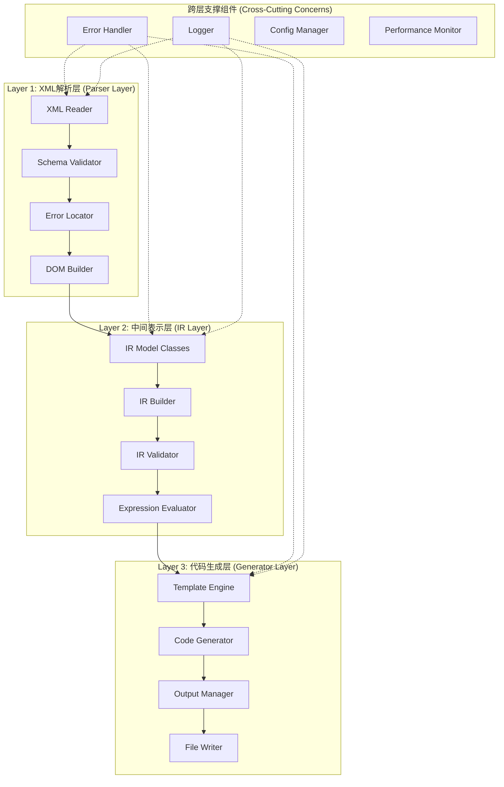
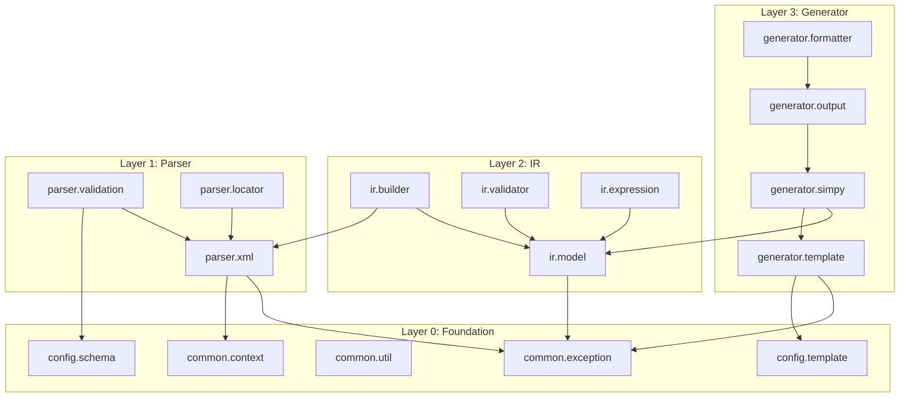

# EATI代码生成器架构设计文档

## 目录
- [1. 整体架构设计](#1-整体架构设计)
- [2. Java包结构设计](#2-java包结构设计)
- [3. 核心接口设计](#3-核心接口设计)
- [4. 错误处理架构](#4-错误处理架构)
- [5. 依赖管理设计](#5-依赖管理设计)
- [6. 性能和扩展性考虑](#6-性能和扩展性考虑)
- [7. 测试架构](#7-测试架构)
- [8. 扩展指南](#8-扩展指南)

---

## 1. 整体架构设计

### 1.1 三层架构定义

基于Clean Architecture原则，设计分层清晰、职责分离的三层架构：



#### Layer 1: XML解析层职责
```java
/**
 * XML解析层 - 负责将EATI XML文档解析为Java对象
 * 
 * 核心职责：
 * 1. XML文档读取和语法验证
 * 2. Schema验证和约束检查
 * 3. 错误定位和异常处理
 * 4. 初步的DOM对象构建
 * 
 * 输入：XML文件流
 * 输出：验证后的DOM Document对象
 */
```

#### Layer 2: 中间表示层职责
```java
/**
 * 中间表示层 - 提供与XML和生成目标解耦的领域模型
 * 
 * 核心职责：
 * 1. 将DOM对象转换为强类型的IR模型
 * 2. 执行语义验证和依赖检查
 * 3. 参数传递路径解析和验证
 * 4. 表达式求值和条件检查
 * 
 * 输入：DOM Document对象
 * 输出：完整的ModelIR对象树
 */
```

#### Layer 3: 代码生成层职责
```java
/**
 * 代码生成层 - 基于IR生成目标代码
 * 
 * 核心职责：
 * 1. 模板加载和缓存管理
 * 2. IR模型到模板变量的映射
 * 3. 代码生成和格式化
 * 4. 输出文件组织和写入
 * 
 * 输入：ModelIR对象 + 生成配置
 * 输出：SimPy Python代码文件
 */
```

### 1.2 架构原则

#### 依赖倒置原则
```java
// 高层模块不依赖低层模块，都依赖抽象
public interface EatiParser {
    ModelIR parse(InputStream xmlInput) throws ParseException;
}

public class DefaultEatiParser implements EatiParser {
    // 依赖注入的XML处理器
    private final XMLProcessor xmlProcessor;
    private final SchemaValidator validator;
}
```

#### 单一职责原则
```java
// 每个类只有一个变化的理由
public class XMLSchemaValidator {
    // 只负责Schema验证
    public ValidationResult validate(Document document, Schema schema);
}

public class IRModelBuilder {
    // 只负责IR模型构建
    public ModelIR buildModel(Document document);
}
```

#### 开闭原则
```java
// 对扩展开放，对修改关闭
public abstract class BaseCodeGenerator {
    public final GenerationResult generate(ModelIR model) {
        // 模板方法模式
        preprocessModel(model);
        String code = generateCode(model);
        return postprocessResult(code);
    }
    
    protected abstract String generateCode(ModelIR model);
}
```

---

## 2. Java包结构设计

### 2.1 根包结构

```
com.eati.generator/
├── parser/                 # XML解析层
│   ├── xml/               # XML处理核心
│   ├── validation/        # Schema和业务验证
│   └── locator/           # 错误定位
├── ir/                    # 中间表示层
│   ├── model/             # IR模型类
│   ├── builder/           # IR构建器
│   ├── validator/         # IR验证器
│   └── expression/        # 表达式处理
├── generator/             # 代码生成层
│   ├── template/          # 模板管理
│   ├── simpy/             # SimPy生成器
│   ├── output/            # 输出管理
│   └── formatter/         # 代码格式化
├── common/                # 通用组件
│   ├── exception/         # 异常体系
│   ├── context/           # 上下文管理
│   └── util/              # 工具类
├── config/                # 配置管理
│   ├── schema/            # 配置Schema
│   ├── template/          # 模板配置
│   └── validation/        # 验证配置
└── cli/                   # 命令行接口
    ├── command/           # 命令处理
    └── option/            # 参数解析
```

### 2.2 详细包职责设计

#### 2.2.1 parser包 - XML解析层

```java
package com.eati.generator.parser;

/**
 * com.eati.generator.parser.xml/
 * 
 * 核心职责：XML文档解析和DOM构建
 * 依赖关系：只依赖JDK和XML库
 * 扩展点：支持自定义XML处理器
 */
public interface XMLProcessor {
    Document parseXML(InputStream input) throws XMLParseException;
}

/**
 * com.eati.generator.parser.validation/
 * 
 * 核心职责：Schema验证和语法检查
 * 依赖关系：依赖xml包
 * 扩展点：支持自定义验证规则
 */
public interface SchemaValidator {
    ValidationResult validate(Document document) throws ValidationException;
}

/**
 * com.eati.generator.parser.locator/
 * 
 * 核心职责：错误定位和上下文提取
 * 依赖关系：依赖xml包
 * 扩展点：支持自定义定位策略
 */
public interface ErrorLocator {
    ErrorLocation locate(Node node, ValidationError error);
}
```

#### 2.2.2 ir包 - 中间表示层

```java
package com.eati.generator.ir;

/**
 * com.eati.generator.ir.model/
 * 
 * 核心职责：IR模型类定义
 * 依赖关系：只依赖common包
 * 扩展点：支持新的EATI元素类型
 */
public abstract class IRComponent {
    private final String id;
    private final ElementLocation location;
    // 通用IR组件行为
}

/**
 * com.eati.generator.ir.builder/
 * 
 * 核心职责：DOM到IR的转换
 * 依赖关系：依赖model包和parser包
 * 扩展点：支持自定义构建策略
 */
public interface IRBuilder {
    ModelIR buildModel(Document document) throws IRBuildException;
}

/**
 * com.eati.generator.ir.validator/
 * 
 * 核心职责：IR模型语义验证
 * 依赖关系：依赖model包
 * 扩展点：支持自定义验证规则
 */
public interface IRValidator {
    ValidationResult validate(ModelIR model) throws ValidationException;
}

/**
 * com.eati.generator.ir.expression/
 * 
 * 核心职责：表达式解析和求值
 * 依赖关系：依赖model包
 * 扩展点：支持自定义函数和操作符
 */
public interface ExpressionEvaluator {
    Object evaluate(Expression expr, EvaluationContext context);
}
```

#### 2.2.3 generator包 - 代码生成层

```java
package com.eati.generator.generator;

/**
 * com.eati.generator.generator.template/
 * 
 * 核心职责：模板加载和管理
 * 依赖关系：依赖FreeMarker
 * 扩展点：支持多种模板引擎
 */
public interface TemplateManager {
    Template loadTemplate(String templateName) throws TemplateException;
    void preloadTemplates(Set<String> templateNames);
}

/**
 * com.eati.generator.generator.simpy/
 * 
 * 核心职责：SimPy代码生成
 * 依赖关系：依赖ir包和template包
 * 扩展点：支持不同的SimPy生成策略
 */
public class SimPyCodeGenerator extends BaseCodeGenerator {
    @Override
    protected GenerationResult generateCode(ModelIR model, GenerationConfig config);
}

/**
 * com.eati.generator.generator.output/
 * 
 * 核心职责：输出文件组织和管理
 * 依赖关系：依赖common包
 * 扩展点：支持不同的输出格式
 */
public interface OutputManager {
    void writeFiles(GenerationResult result, Path outputDir) throws OutputException;
}
```

### 2.3 包依赖关系图



---

## 3. 核心接口设计

### 3.1 主要接口定义

#### 3.1.1 解析器层接口

```java
package com.eati.generator.parser;

/**
 * EATI解析器主接口
 * 
 * 职责：协调XML解析的各个阶段
 * 输入：XML文档流
 * 输出：验证后的ModelIR对象
 */
public interface EatiParser {
    /**
     * 解析EATI XML文档
     * 
     * @param xmlInput XML文档输入流
     * @param options 解析选项
     * @return 完整的ModelIR对象
     * @throws ParseException 解析失败时抛出
     */
    ModelIR parse(InputStream xmlInput, ParseOptions options) throws ParseException;
    
    /**
     * 验证XML文档但不构建IR
     * 
     * @param xmlInput XML文档输入流
     * @return 验证结果
     * @throws ValidationException 验证失败时抛出
     */
    ValidationResult validateOnly(InputStream xmlInput) throws ValidationException;
    
    /**
     * 获取支持的Schema版本
     */
    Set<String> getSupportedSchemaVersions();
}

/**
 * XML处理器接口
 * 
 * 职责：底层XML文档解析
 */
public interface XMLProcessor {
    /**
     * 解析XML文档为DOM对象
     */
    Document parseXML(InputStream input, XMLParseOptions options) throws XMLParseException;
    
    /**
     * 设置自定义EntityResolver
     */
    void setEntityResolver(EntityResolver resolver);
    
    /**
     * 设置错误处理器
     */
    void setErrorHandler(ErrorHandler handler);
}

/**
 * Schema验证器接口
 */
public interface SchemaValidator {
    /**
     * 验证文档是否符合EATI Schema
     */
    ValidationResult validate(Document document, Schema schema) throws ValidationException;
    
    /**
     * 批量验证多个文档
     */
    Map<String, ValidationResult> validateBatch(Map<String, Document> documents);
    
    /**
     * 获取详细的验证报告
     */
    ValidationReport getDetailedReport(Document document);
}
```

#### 3.1.2 IR层接口

```java
package com.eati.generator.ir;

/**
 * IR构建器主接口
 * 
 * 职责：将DOM对象转换为强类型IR模型
 */
public interface IRBuilder {
    /**
     * 构建完整的IR模型
     * 
     * @param document 验证后的XML文档
     * @param context 构建上下文
     * @return 完整的ModelIR对象
     * @throws IRBuildException 构建失败时抛出
     */
    ModelIR buildModel(Document document, BuildContext context) throws IRBuildException;
    
    /**
     * 部分构建，用于增量更新
     * 
     * @param element 特定的XML元素
     * @param existingModel 现有的IR模型
     * @return 更新后的IR组件
     */
    IRComponent buildComponent(Element element, ModelIR existingModel) throws IRBuildException;
    
    /**
     * 注册自定义组件构建器
     */
    void registerComponentBuilder(String elementName, ComponentBuilder builder);
}

/**
 * IR验证器接口
 * 
 * 职责：验证IR模型的语义正确性
 */
public interface IRValidator {
    /**
     * 验证完整的IR模型
     */
    ValidationResult validate(ModelIR model) throws ValidationException;
    
    /**
     * 验证特定组件
     */
    ValidationResult validateComponent(IRComponent component, ValidationContext context);
    
    /**
     * 验证组件间的依赖关系
     */
    ValidationResult validateDependencies(ModelIR model);
    
    /**
     * 添加自定义验证规则
     */
    void addValidationRule(ValidationRule rule);
}

/**
 * 表达式求值器接口
 * 
 * 职责：解析和计算EATI表达式
 */
public interface ExpressionEvaluator {
    /**
     * 求值表达式
     * 
     * @param expression 表达式对象
     * @param context 求值上下文
     * @return 计算结果
     * @throws ExpressionException 求值失败时抛出
     */
    Object evaluate(Expression expression, EvaluationContext context) throws ExpressionException;
    
    /**
     * 验证表达式语法
     */
    ValidationResult validateSyntax(String expressionText);
    
    /**
     * 提取表达式中的变量引用
     */
    Set<String> extractVariableReferences(Expression expression);
    
    /**
     * 注册自定义函数
     */
    void registerFunction(String name, Function function);
}
```

#### 3.1.3 生成器层接口

```java
package com.eati.generator.generator;

/**
 * 代码生成器主接口
 * 
 * 职责：基于IR模型生成目标代码
 */
public interface CodeGenerator {
    /**
     * 生成代码
     * 
     * @param model IR模型
     * @param config 生成配置
     * @return 生成结果
     * @throws GenerationException 生成失败时抛出
     */
    GenerationResult generate(ModelIR model, GenerationConfig config) throws GenerationException;
    
    /**
     * 预览生成结果（不写入文件）
     */
    GenerationPreview preview(ModelIR model, GenerationConfig config);
    
    /**
     * 获取支持的生成目标
     */
    Set<String> getSupportedTargets();
    
    /**
     * 验证生成配置
     */
    ValidationResult validateConfig(GenerationConfig config);
}

/**
 * 模板管理器接口
 */
public interface TemplateManager {
    /**
     * 加载模板
     * 
     * @param templateName 模板名称
     * @param templateType 模板类型
     * @return 模板对象
     * @throws TemplateException 加载失败时抛出
     */
    Template loadTemplate(String templateName, TemplateType templateType) throws TemplateException;
    
    /**
     * 预加载模板集合
     */
    void preloadTemplates(Set<String> templateNames) throws TemplateException;
    
    /**
     * 重新加载模板（用于开发模式）
     */
    void reloadTemplate(String templateName) throws TemplateException;
    
    /**
     * 获取模板依赖关系
     */
    Map<String, Set<String>> getTemplateDependencies();
}

/**
 * 输出管理器接口
 */
public interface OutputManager {
    /**
     * 写入生成的文件
     * 
     * @param result 生成结果
     * @param outputDir 输出目录
     * @throws OutputException 写入失败时抛出
     */
    void writeFiles(GenerationResult result, Path outputDir) throws OutputException;
    
    /**
     * 清理输出目录
     */
    void cleanOutputDirectory(Path outputDir) throws OutputException;
    
    /**
     * 验证输出目录权限
     */
    boolean canWriteToDirectory(Path outputDir);
    
    /**
     * 获取文件写入统计
     */
    OutputStatistics getStatistics();
}
```

### 3.2 关键抽象类设计

#### 3.2.1 BaseParser - XML解析基础

```java
package com.eati.generator.parser;

/**
 * XML解析器抽象基类
 * 
 * 提供通用的解析框架和错误处理
 */
public abstract class BaseParser implements EatiParser {
    
    protected final XMLProcessor xmlProcessor;
    protected final SchemaValidator validator;
    protected final ErrorLocator errorLocator;
    protected final ParseOptions defaultOptions;
    
    protected BaseParser(XMLProcessor xmlProcessor, 
                        SchemaValidator validator,
                        ErrorLocator errorLocator) {
        this.xmlProcessor = xmlProcessor;
        this.validator = validator;
        this.errorLocator = errorLocator;
        this.defaultOptions = createDefaultOptions();
    }
    
    @Override
    public final ModelIR parse(InputStream xmlInput, ParseOptions options) throws ParseException {
        try {
            // 1. 预处理
            ParseContext context = createParseContext(options);
            
            // 2. XML解析
            Document document = parseXMLDocument(xmlInput, context);
            
            // 3. Schema验证
            ValidationResult validationResult = validateDocument(document, context);
            if (!validationResult.isValid()) {
                throw new SchemaValidationException(validationResult);
            }
            
            // 4. IR构建
            ModelIR model = buildIRModel(document, context);
            
            // 5. 后处理
            postProcessModel(model, context);
            
            return model;
            
        } catch (Exception e) {
            handleParseError(e, xmlInput);
            throw new ParseException("Failed to parse EATI document", e);
        }
    }
    
    // 模板方法 - 子类可重写
    protected abstract ParseContext createParseContext(ParseOptions options);
    protected abstract ModelIR buildIRModel(Document document, ParseContext context);
    protected abstract void postProcessModel(ModelIR model, ParseContext context);
    
    // 通用方法
    protected Document parseXMLDocument(InputStream input, ParseContext context) throws XMLParseException {
        return xmlProcessor.parseXML(input, context.getXMLOptions());
    }
    
    protected ValidationResult validateDocument(Document document, ParseContext context) throws ValidationException {
        return validator.validate(document, context.getSchema());
    }
    
    protected void handleParseError(Exception error, InputStream input) {
        // 统一错误处理逻辑
        ErrorLocation location = errorLocator.locate(error);
        logError(error, location);
    }
}
```

#### 3.2.2 BaseIRComponent - IR组件基础

```java
package com.eati.generator.ir.model;

/**
 * IR组件抽象基类
 * 
 * 提供所有IR组件的通用行为
 */
public abstract class BaseIRComponent implements IRComponent {
    
    private final String id;
    private final String name;
    private final ElementLocation location;
    private final Map<String, Object> attributes;
    private final List<ValidationError> validationErrors;
    
    protected BaseIRComponent(String id, String name, ElementLocation location) {
        this.id = requireNonNull(id, "Component ID cannot be null");
        this.name = name;
        this.location = location;
        this.attributes = new ConcurrentHashMap<>();
        this.validationErrors = new CopyOnWriteArrayList<>();
    }
    
    @Override
    public String getId() {
        return id;
    }
    
    @Override
    public String getName() {
        return name;
    }
    
    @Override
    public ElementLocation getLocation() {
        return location;
    }
    
    @Override
    public <T> T getAttribute(String key, Class<T> type) {
        Object value = attributes.get(key);
        return type.isInstance(value) ? type.cast(value) : null;
    }
    
    @Override
    public void setAttribute(String key, Object value) {
        attributes.put(key, value);
    }
    
    @Override
    public ValidationResult validate(ValidationContext context) {
        List<ValidationError> errors = new ArrayList<>(validationErrors);
        
        // 执行组件特定验证
        errors.addAll(performSpecificValidation(context));
        
        // 验证依赖关系
        errors.addAll(validateDependencies(context));
        
        return new ValidationResult(errors);
    }
    
    // 抽象方法 - 子类实现特定验证逻辑
    protected abstract List<ValidationError> performSpecificValidation(ValidationContext context);
    protected abstract List<ValidationError> validateDependencies(ValidationContext context);
    
    // 通用验证辅助方法
    protected void addValidationError(String message, ErrorSeverity severity) {
        validationErrors.add(new ValidationError(message, severity, location));
    }
    
    protected boolean isValidId(String id) {
        return id != null && id.matches("[a-zA-Z][a-zA-Z0-9_]*");
    }
    
    @Override
    public boolean equals(Object obj) {
        if (this == obj) return true;
        if (obj == null || getClass() != obj.getClass()) return false;
        BaseIRComponent that = (BaseIRComponent) obj;
        return Objects.equals(id, that.id);
    }
    
    @Override
    public int hashCode() {
        return Objects.hash(id);
    }
    
    @Override
    public String toString() {
        return String.format("%s{id='%s', name='%s'}", 
                           getClass().getSimpleName(), id, name);
    }
}
```

#### 3.2.3 BaseGenerator - 代码生成基础

```java
package com.eati.generator.generator;

/**
 * 代码生成器抽象基类
 * 
 * 提供代码生成的通用框架
 */
public abstract class BaseCodeGenerator implements CodeGenerator {
    
    protected final TemplateManager templateManager;
    protected final OutputManager outputManager;
    protected final GenerationConfig defaultConfig;
    
    protected BaseCodeGenerator(TemplateManager templateManager,
                               OutputManager outputManager) {
        this.templateManager = templateManager;
        this.outputManager = outputManager;
        this.defaultConfig = createDefaultConfig();
    }
    
    @Override
    public final GenerationResult generate(ModelIR model, GenerationConfig config) throws GenerationException {
        try {
            // 1. 预处理
            GenerationContext context = createGenerationContext(model, config);
            validateModelForGeneration(model, context);
            
            // 2. 准备模板数据
            Map<String, Object> templateData = prepareTemplateData(model, context);
            
            // 3. 生成代码
            Map<String, String> generatedFiles = generateFiles(templateData, context);
            
            // 4. 后处理
            generatedFiles = postProcessGeneratedFiles(generatedFiles, context);
            
            // 5. 创建结果
            return createGenerationResult(generatedFiles, context);
            
        } catch (Exception e) {
            handleGenerationError(e, model, config);
            throw new GenerationException("Failed to generate code", e);
        }
    }
    
    // 模板方法 - 子类实现
    protected abstract GenerationContext createGenerationContext(ModelIR model, GenerationConfig config);
    protected abstract Map<String, Object> prepareTemplateData(ModelIR model, GenerationContext context);
    protected abstract Map<String, String> generateFiles(Map<String, Object> templateData, GenerationContext context);
    
    // 可重写的方法
    protected void validateModelForGeneration(ModelIR model, GenerationContext context) throws GenerationException {
        ValidationResult result = model.validate();
        if (!result.isValid()) {
            throw new GenerationException("Model validation failed: " + result.getErrorSummary());
        }
    }
    
    protected Map<String, String> postProcessGeneratedFiles(Map<String, String> files, GenerationContext context) {
        // 默认不做后处理
        return files;
    }
    
    protected GenerationResult createGenerationResult(Map<String, String> files, GenerationContext context) {
        return GenerationResult.builder()
                .files(files)
                .statistics(context.getStatistics())
                .metadata(context.getMetadata())
                .build();
    }
    
    // 通用辅助方法
    protected String renderTemplate(String templateName, Map<String, Object> data, GenerationContext context) throws TemplateException {
        Template template = templateManager.loadTemplate(templateName, context.getTemplateType());
        return template.render(data);
    }
    
    protected void handleGenerationError(Exception error, ModelIR model, GenerationConfig config) {
        // 统一错误处理和日志记录
        logGenerationError(error, model.getId(), config.getTarget());
    }
}
```

---

## 4. 错误处理架构

### 4.1 异常层次设计

```java
package com.eati.generator.common.exception;

/**
 * 异常层次结构
 * 
 * 设计原则：
 * 1. 每层有独立的异常类型
 * 2. 异常包含丰富的上下文信息
 * 3. 支持异常链和原因追踪
 * 4. 提供错误恢复建议
 */

/**
 * EATI代码生成器根异常
 */
public abstract class EatiException extends Exception {
    
    private final ErrorCode errorCode;
    private final ErrorContext context;
    private final List<String> recoverySuggestions;
    
    protected EatiException(ErrorCode errorCode, String message, ErrorContext context) {
        super(message);
        this.errorCode = errorCode;
        this.context = context;
        this.recoverySuggestions = new ArrayList<>();
    }
    
    protected EatiException(ErrorCode errorCode, String message, Throwable cause, ErrorContext context) {
        super(message, cause);
        this.errorCode = errorCode;
        this.context = context;
        this.recoverySuggestions = new ArrayList<>();
    }
    
    public ErrorCode getErrorCode() { return errorCode; }
    public ErrorContext getContext() { return context; }
    public List<String> getRecoverySuggestions() { return Collections.unmodifiableList(recoverySuggestions); }
    
    public void addRecoverySuggestion(String suggestion) {
        recoverySuggestions.add(suggestion);
    }
    
    /**
     * 获取详细的错误报告
     */
    public ErrorReport getDetailedReport() {
        return ErrorReport.builder()
                .errorCode(errorCode)
                .message(getMessage())
                .context(context)
                .stackTrace(getStackTrace())
                .recoverySuggestions(recoverySuggestions)
                .cause(getCause())
                .build();
    }
}

/**
 * 解析层异常
 */
public abstract class ParseException extends EatiException {
    
    protected ParseException(ErrorCode errorCode, String message, ErrorContext context) {
        super(errorCode, message, context);
    }
    
    protected ParseException(ErrorCode errorCode, String message, Throwable cause, ErrorContext context) {
        super(errorCode, message, cause, context);
    }
}

/**
 * Schema验证异常
 */
public class SchemaValidationException extends ParseException {
    
    private final ValidationResult validationResult;
    
    public SchemaValidationException(ValidationResult validationResult) {
        super(ErrorCode.SCHEMA_VALIDATION_FAILED, 
              "Schema validation failed with " + validationResult.getErrorCount() + " errors",
              extractContext(validationResult));
        this.validationResult = validationResult;
        
        // 添加恢复建议
        addRecoverySuggestion("Check the XML document against EATI Schema 2.2.1");
        addRecoverySuggestion("Verify all required elements are present");
    }
    
    public ValidationResult getValidationResult() {
        return validationResult;
    }
    
    private static ErrorContext extractContext(ValidationResult result) {
        return ErrorContext.builder()
                .source("Schema Validation")
                .details(result.getErrorSummary())
                .build();
    }
}

/**
 * XML语法异常
 */
public class XMLSyntaxException extends ParseException {
    
    private final int lineNumber;
    private final int columnNumber;
    
    public XMLSyntaxException(String message, int lineNumber, int columnNumber, Throwable cause) {
        super(ErrorCode.XML_SYNTAX_ERROR, message, cause, 
              ErrorContext.builder()
                         .source("XML Parser")
                         .location(new ElementLocation(lineNumber, columnNumber))
                         .build());
        this.lineNumber = lineNumber;
        this.columnNumber = columnNumber;
        
        addRecoverySuggestion("Check XML syntax near line " + lineNumber + ", column " + columnNumber);
        addRecoverySuggestion("Ensure all XML tags are properly closed");
    }
    
    public int getLineNumber() { return lineNumber; }
    public int getColumnNumber() { return columnNumber; }
}

/**
 * 缺失元素异常
 */
public class MissingElementException extends ParseException {
    
    private final String requiredElement;
    private final String parentElement;
    
    public MissingElementException(String requiredElement, String parentElement, ElementLocation location) {
        super(ErrorCode.MISSING_REQUIRED_ELEMENT,
              String.format("Required element '%s' is missing from '%s'", requiredElement, parentElement),
              ErrorContext.builder()
                         .source("Element Validation")
                         .location(location)
                         .build());
        this.requiredElement = requiredElement;
        this.parentElement = parentElement;
        
        addRecoverySuggestion("Add the required element '" + requiredElement + "' to '" + parentElement + "'");
    }
    
    public String getRequiredElement() { return requiredElement; }
    public String getParentElement() { return parentElement; }
}

/**
 * IR层异常
 */
public abstract class IRException extends EatiException {
    
    protected IRException(ErrorCode errorCode, String message, ErrorContext context) {
        super(errorCode, message, context);
    }
    
    protected IRException(ErrorCode errorCode, String message, Throwable cause, ErrorContext context) {
        super(errorCode, message, cause, context);
    }
}

/**
 * IR验证异常
 */
public class IRValidationException extends IRException {
    
    private final List<ValidationError> validationErrors;
    
    public IRValidationException(List<ValidationError> validationErrors) {
        super(ErrorCode.IR_VALIDATION_FAILED,
              "IR validation failed with " + validationErrors.size() + " errors",
              createContext(validationErrors));
        this.validationErrors = new ArrayList<>(validationErrors);
        
        addRecoverySuggestion("Review the validation errors and fix the model definition");
    }
    
    public List<ValidationError> getValidationErrors() {
        return Collections.unmodifiableList(validationErrors);
    }
    
    private static ErrorContext createContext(List<ValidationError> errors) {
        return ErrorContext.builder()
                .source("IR Validation")
                .details("Validation errors: " + errors.size())
                .build();
    }
}

/**
 * 映射异常
 */
public class MappingException extends IRException {
    
    private final String sourceElement;
    private final String targetType;
    
    public MappingException(String sourceElement, String targetType, String reason, Throwable cause) {
        super(ErrorCode.MAPPING_FAILED,
              String.format("Failed to map '%s' to '%s': %s", sourceElement, targetType, reason),
              cause,
              ErrorContext.builder()
                         .source("IR Mapping")
                         .details("Source: " + sourceElement + ", Target: " + targetType)
                         .build());
        this.sourceElement = sourceElement;
        this.targetType = targetType;
        
        addRecoverySuggestion("Check if the source element structure matches the expected format");
        addRecoverySuggestion("Verify the target type is supported by the current mapping rules");
    }
    
    public String getSourceElement() { return sourceElement; }
    public String getTargetType() { return targetType; }
}

/**
 * 依赖异常
 */
public class DependencyException extends IRException {
    
    private final String componentId;
    private final String dependencyId;
    private final DependencyType dependencyType;
    
    public DependencyException(String componentId, String dependencyId, DependencyType type, String reason) {
        super(ErrorCode.DEPENDENCY_ERROR,
              String.format("Dependency error in '%s': %s dependency '%s' - %s", 
                          componentId, type, dependencyId, reason),
              ErrorContext.builder()
                         .source("Dependency Resolution")
                         .details("Component: " + componentId + ", Dependency: " + dependencyId)
                         .build());
        this.componentId = componentId;
        this.dependencyId = dependencyId;
        this.dependencyType = type;
        
        addRecoverySuggestion("Ensure the referenced component '" + dependencyId + "' exists");
        addRecoverySuggestion("Check the dependency order and circular references");
    }
    
    public String getComponentId() { return componentId; }
    public String getDependencyId() { return dependencyId; }
    public DependencyType getDependencyType() { return dependencyType; }
}

/**
 * 生成层异常
 */
public abstract class GenerationException extends EatiException {
    
    protected GenerationException(ErrorCode errorCode, String message, ErrorContext context) {
        super(errorCode, message, context);
    }
    
    protected GenerationException(ErrorCode errorCode, String message, Throwable cause, ErrorContext context) {
        super(errorCode, message, cause, context);
    }
}

/**
 * 模板异常
 */
public class TemplateException extends GenerationException {
    
    private final String templateName;
    private final TemplateError templateError;
    
    public TemplateException(String templateName, TemplateError error, Throwable cause) {
        super(ErrorCode.TEMPLATE_ERROR,
              String.format("Template error in '%s': %s", templateName, error.getMessage()),
              cause,
              ErrorContext.builder()
                         .source("Template Processing")
                         .location(error.getLocation())
                         .details("Template: " + templateName)
                         .build());
        this.templateName = templateName;
        this.templateError = error;
        
        addRecoverySuggestion("Check the template syntax and variable references");
        addRecoverySuggestion("Verify all required template data is provided");
    }
    
    public String getTemplateName() { return templateName; }
    public TemplateError getTemplateError() { return templateError; }
}

/**
 * 输出异常
 */
public class OutputException extends GenerationException {
    
    private final Path outputPath;
    private final OutputError outputError;
    
    public OutputException(Path outputPath, OutputError error, Throwable cause) {
        super(ErrorCode.OUTPUT_ERROR,
              String.format("Output error for '%s': %s", outputPath, error.getMessage()),
              cause,
              ErrorContext.builder()
                         .source("File Output")
                         .details("Path: " + outputPath)
                         .build());
        this.outputPath = outputPath;
        this.outputError = error;
        
        addRecoverySuggestion("Check file system permissions for the output directory");
        addRecoverySuggestion("Ensure sufficient disk space is available");
    }
    
    public Path getOutputPath() { return outputPath; }
    public OutputError getOutputError() { return outputError; }
}

/**
 * 配置异常
 */
public class ConfigurationException extends GenerationException {
    
    private final String configKey;
    private final Object configValue;
    
    public ConfigurationException(String configKey, Object configValue, String reason) {
        super(ErrorCode.CONFIGURATION_ERROR,
              String.format("Configuration error for '%s' = '%s': %s", configKey, configValue, reason),
              ErrorContext.builder()
                         .source("Configuration")
                         .details("Key: " + configKey + ", Value: " + configValue)
                         .build());
        this.configKey = configKey;
        this.configValue = configValue;
        
        addRecoverySuggestion("Check the configuration value format and constraints");
        addRecoverySuggestion("Refer to the configuration documentation for valid values");
    }
    
    public String getConfigKey() { return configKey; }
    public Object getConfigValue() { return configValue; }
}
```

### 4.2 错误上下文和定位

```java
package com.eati.generator.common.exception;

/**
 * 错误上下文信息
 * 
 * 提供丰富的错误上下文，便于问题定位和修复
 */
public class ErrorContext {
    
    private final String source;           // 错误来源（组件名称）
    private final ElementLocation location; // 文档位置
    private final String details;          // 详细信息
    private final Map<String, Object> additionalData; // 额外数据
    
    private ErrorContext(Builder builder) {
        this.source = builder.source;
        this.location = builder.location;
        this.details = builder.details;
        this.additionalData = Collections.unmodifiableMap(new HashMap<>(builder.additionalData));
    }
    
    public String getSource() { return source; }
    public ElementLocation getLocation() { return location; }
    public String getDetails() { return details; }
    public Map<String, Object> getAdditionalData() { return additionalData; }
    
    /**
     * 获取XPath表达式（如果可用）
     */
    public Optional<String> getXPath() {
        Object xpath = additionalData.get("xpath");
        return xpath instanceof String ? Optional.of((String) xpath) : Optional.empty();
    }
    
    /**
     * 获取元素名称（如果可用）
     */
    public Optional<String> getElementName() {
        Object elementName = additionalData.get("elementName");
        return elementName instanceof String ? Optional.of((String) elementName) : Optional.empty();
    }
    
    public static Builder builder() {
        return new Builder();
    }
    
    public static class Builder {
        private String source;
        private ElementLocation location;
        private String details;
        private Map<String, Object> additionalData = new HashMap<>();
        
        public Builder source(String source) {
            this.source = source;
            return this;
        }
        
        public Builder location(ElementLocation location) {
            this.location = location;
            return this;
        }
        
        public Builder location(int line, int column) {
            this.location = new ElementLocation(line, column);
            return this;
        }
        
        public Builder details(String details) {
            this.details = details;
            return this;
        }
        
        public Builder xpath(String xpath) {
            this.additionalData.put("xpath", xpath);
            return this;
        }
        
        public Builder elementName(String elementName) {
            this.additionalData.put("elementName", elementName);
            return this;
        }
        
        public Builder additionalData(String key, Object value) {
            this.additionalData.put(key, value);
            return this;
        }
        
        public ErrorContext build() {
            return new ErrorContext(this);
        }
    }
}

/**
 * 元素位置信息
 */
public class ElementLocation {
    
    private final int lineNumber;
    private final int columnNumber;
    private final String fileName;
    private final String xpath;
    
    public ElementLocation(int lineNumber, int columnNumber) {
        this(lineNumber, columnNumber, null, null);
    }
    
    public ElementLocation(int lineNumber, int columnNumber, String fileName, String xpath) {
        this.lineNumber = lineNumber;
        this.columnNumber = columnNumber;
        this.fileName = fileName;
        this.xpath = xpath;
    }
    
    public int getLineNumber() { return lineNumber; }
    public int getColumnNumber() { return columnNumber; }
    public String getFileName() { return fileName; }
    public String getXPath() { return xpath; }
    
    /**
     * 生成用户友好的位置描述
     */
    public String getDisplayString() {
        StringBuilder sb = new StringBuilder();
        
        if (fileName != null) {
            sb.append(fileName);
        }
        
        if (lineNumber > 0) {
            if (sb.length() > 0) sb.append(":");
            sb.append("line ").append(lineNumber);
            
            if (columnNumber > 0) {
                sb.append(", column ").append(columnNumber);
            }
        }
        
        if (xpath != null) {
            if (sb.length() > 0) sb.append(" ");
            sb.append("(").append(xpath).append(")");
        }
        
        return sb.toString();
    }
    
    @Override
    public String toString() {
        return getDisplayString();
    }
}

/**
 * 错误代码枚举
 * 
 * 提供结构化的错误代码，便于错误分类和处理
 */
public enum ErrorCode {
    
    // 解析层错误 (1000-1999)
    XML_SYNTAX_ERROR(1001, "XML语法错误"),
    SCHEMA_VALIDATION_FAILED(1002, "Schema验证失败"),
    MISSING_REQUIRED_ELEMENT(1003, "缺少必需元素"),
    INVALID_ATTRIBUTE_VALUE(1004, "属性值无效"),
    NAMESPACE_ERROR(1005, "命名空间错误"),
    
    // IR层错误 (2000-2999)
    IR_VALIDATION_FAILED(2001, "IR验证失败"),
    MAPPING_FAILED(2002, "映射失败"),
    DEPENDENCY_ERROR(2003, "依赖错误"),
    EXPRESSION_ERROR(2004, "表达式错误"),
    TYPE_MISMATCH(2005, "类型不匹配"),
    
    // 生成层错误 (3000-3999)
    TEMPLATE_ERROR(3001, "模板错误"),
    OUTPUT_ERROR(3002, "输出错误"),
    CONFIGURATION_ERROR(3003, "配置错误"),
    GENERATOR_ERROR(3004, "生成器错误"),
    
    // 系统错误 (9000-9999)
    INTERNAL_ERROR(9001, "内部错误"),
    RESOURCE_ERROR(9002, "资源错误"),
    TIMEOUT_ERROR(9003, "超时错误");
    
    private final int code;
    private final String description;
    
    ErrorCode(int code, String description) {
        this.code = code;
        this.description = description;
    }
    
    public int getCode() { return code; }
    public String getDescription() { return description; }
    
    /**
     * 根据错误代码获取ErrorCode
     */
    public static ErrorCode fromCode(int code) {
        for (ErrorCode errorCode : values()) {
            if (errorCode.code == code) {
                return errorCode;
            }
        }
        throw new IllegalArgumentException("Unknown error code: " + code);
    }
}
```

### 4.3 错误处理策略

```java
package com.eati.generator.common.exception;

/**
 * 错误处理策略
 * 
 * 定义不同层级的错误处理和恢复策略
 */
public class ErrorHandlingStrategy {
    
    /**
     * 解析错误处理策略
     */
    public static class ParseErrorStrategy {
        
        /**
         * 处理Schema验证错误
         */
        public static ParseResult handleSchemaValidationError(SchemaValidationException e, ParseOptions options) {
            if (options.isStrictMode()) {
                // 严格模式：直接抛出异常
                throw e;
            } else {
                // 宽松模式：收集错误但继续处理
                return ParseResult.withErrors(e.getValidationResult().getErrors());
            }
        }
        
        /**
         * 处理XML语法错误
         */
        public static ParseResult handleXMLSyntaxError(XMLSyntaxException e, ParseOptions options) {
            // XML语法错误无法恢复，总是抛出异常
            throw e;
        }
        
        /**
         * 处理缺失元素错误
         */
        public static ParseResult handleMissingElementError(MissingElementException e, ParseOptions options) {
            if (options.isUseDefaultValues()) {
                // 使用默认值继续处理
                return ParseResult.withWarning("Using default value for missing element: " + e.getRequiredElement());
            } else {
                throw e;
            }
        }
    }
    
    /**
     * IR错误处理策略
     */
    public static class IRErrorStrategy {
        
        /**
         * 处理验证错误
         */
        public static IRResult handleValidationError(IRValidationException e, BuildOptions options) {
            List<ValidationError> errors = e.getValidationErrors();
            
            // 按严重性分组
            Map<ErrorSeverity, List<ValidationError>> groupedErrors = errors.stream()
                    .collect(Collectors.groupingBy(ValidationError::getSeverity));
            
            if (groupedErrors.containsKey(ErrorSeverity.ERROR) && options.isStrictValidation()) {
                // 有ERROR级别错误且是严格模式
                throw e;
            } else {
                // 只有WARNING级别错误或者是宽松模式
                return IRResult.withWarnings(errors);
            }
        }
        
        /**
         * 处理依赖错误
         */
        public static IRResult handleDependencyError(DependencyException e, BuildOptions options) {
            if (options.isIgnoreMissingDependencies()) {
                // 忽略缺失的依赖
                return IRResult.withWarning("Ignoring missing dependency: " + e.getDependencyId());
            } else {
                throw e;
            }
        }
    }
    
    /**
     * 生成错误处理策略
     */
    public static class GenerationErrorStrategy {
        
        /**
         * 处理模板错误
         */
        public static GenerationResult handleTemplateError(TemplateException e, GenerationOptions options) {
            if (options.isContinueOnTemplateError()) {
                // 跳过失败的模板，继续生成其他文件
                return GenerationResult.withError("Skipped template due to error: " + e.getTemplateName());
            } else {
                throw e;
            }
        }
        
        /**
         * 处理输出错误
         */
        public static GenerationResult handleOutputError(OutputException e, GenerationOptions options) {
            if (options.isRetryOnOutputError()) {
                // 重试输出
                try {
                    return retryOutput(e.getOutputPath(), options.getRetryCount());
                } catch (Exception retryException) {
                    throw new OutputException(e.getOutputPath(), 
                                            new OutputError("Retry failed", retryException), 
                                            retryException);
                }
            } else {
                throw e;
            }
        }
        
        private static GenerationResult retryOutput(Path outputPath, int retryCount) throws Exception {
            // 实现重试逻辑
            for (int i = 0; i < retryCount; i++) {
                try {
                    // 尝试重新输出
                    Thread.sleep(1000 * (i + 1)); // 指数退避
                    // ... 重试逻辑
                    return GenerationResult.success();
                } catch (Exception e) {
                    if (i == retryCount - 1) {
                        throw e; // 最后一次重试失败
                    }
                }
            }
            throw new IllegalStateException("Unexpected retry failure");
        }
    }
}
```

---

## 5. 依赖管理设计

### 5.1 外部依赖约束

#### 5.1.1 Maven依赖定义

```xml
<!-- pom.xml -->
<dependencies>
    <!-- XML处理 -->
    <dependency>
        <groupId>javax.xml.bind</groupId>
        <artifactId>jaxb-api</artifactId>
        <version>2.3.1</version>
    </dependency>
    
    <dependency>
        <groupId>org.glassfish.jaxb</groupId>
        <artifactId>jaxb-runtime</artifactId>
        <version>2.3.5</version>
    </dependency>
    
    <dependency>
        <groupId>xerces</groupId>
        <artifactId>xercesImpl</artifactId>
        <version>2.12.2</version>
    </dependency>
    
    <!-- 模板引擎 -->
    <dependency>
        <groupId>org.freemarker</groupId>
        <artifactId>freemarker</artifactId>
        <version>2.3.32</version>
    </dependency>
    
    <!-- 日志 -->
    <dependency>
        <groupId>org.slf4j</groupId>
        <artifactId>slf4j-api</artifactId>
        <version>1.7.36</version>
    </dependency>
    
    <dependency>
        <groupId>ch.qos.logback</groupId>
        <artifactId>logback-classic</artifactId>
        <version>1.2.12</version>
    </dependency>
    
    <!-- 工具库 -->
    <dependency>
        <groupId>com.google.guava</groupId>
        <artifactId>guava</artifactId>
        <version>31.1-jre</version>
    </dependency>
    
    <dependency>
        <groupId>org.apache.commons</groupId>
        <artifactId>commons-lang3</artifactId>
        <version>3.12.0</version>
    </dependency>
    
    <!-- 测试 -->
    <dependency>
        <groupId>org.junit.jupiter</groupId>
        <artifactId>junit-jupiter</artifactId>
        <version>5.9.2</version>
        <scope>test</scope>
    </dependency>
    
    <dependency>
        <groupId>org.mockito</groupId>
        <artifactId>mockito-core</artifactId>
        <version>4.11.0</version>
        <scope>test</scope>
    </dependency>
    
    <dependency>
        <groupId>org.assertj</groupId>
        <artifactId>assertj-core</artifactId>
        <version>3.24.2</version>
        <scope>test</scope>
    </dependency>
</dependencies>
```

### 5.2 依赖隔离策略

#### 5.2.1 服务提供者接口(SPI)

```java
package com.eati.generator.common.spi;

/**
 * XML处理器SPI
 * 
 * 隔离XML处理库依赖，支持不同实现
 */
public interface XMLProcessorProvider {
    
    /**
     * 创建XML处理器实例
     */
    XMLProcessor createProcessor(XMLProcessorConfig config);
    
    /**
     * 获取提供者名称
     */
    String getProviderName();
    
    /**
     * 获取支持的特性
     */
    Set<XMLFeature> getSupportedFeatures();
    
    /**
     * 检查是否可用
     */
    boolean isAvailable();
}

/**
 * JAXB实现的XML处理器提供者
 */
public class JAXBXMLProcessorProvider implements XMLProcessorProvider {
    
    @Override
    public XMLProcessor createProcessor(XMLProcessorConfig config) {
        return new JAXBXMLProcessor(config);
    }
    
    @Override
    public String getProviderName() {
        return "JAXB";
    }
    
    @Override
    public Set<XMLFeature> getSupportedFeatures() {
        return EnumSet.of(
            XMLFeature.SCHEMA_VALIDATION,
            XMLFeature.NAMESPACE_AWARE,
            XMLFeature.DTD_VALIDATION
        );
    }
    
    @Override
    public boolean isAvailable() {
        try {
            Class.forName("javax.xml.bind.JAXBContext");
            return true;
        } catch (ClassNotFoundException e) {
            return false;
        }
    }
}

/**
 * 模板引擎SPI
 */
public interface TemplateEngineProvider {
    
    /**
     * 创建模板引擎实例
     */
    TemplateEngine createEngine(TemplateEngineConfig config);
    
    /**
     * 获取引擎名称
     */
    String getEngineName();
    
    /**
     * 获取支持的模板类型
     */
    Set<String> getSupportedTemplateTypes();
    
    /**
     * 检查是否可用
     */
    boolean isAvailable();
}

/**
 * FreeMarker实现的模板引擎提供者
 */
public class FreeMarkerTemplateEngineProvider implements TemplateEngineProvider {
    
    @Override
    public TemplateEngine createEngine(TemplateEngineConfig config) {
        return new FreeMarkerTemplateEngine(config);
    }
    
    @Override
    public String getEngineName() {
        return "FreeMarker";
    }
    
    @Override
    public Set<String> getSupportedTemplateTypes() {
        return Set.of("ftl", "ftlh", "ftlx");
    }
    
    @Override
    public boolean isAvailable() {
        try {
            Class.forName("freemarker.template.Configuration");
            return true;
        } catch (ClassNotFoundException e) {
            return false;
        }
    }
}
```

#### 5.2.2 依赖注入容器

```java
package com.eati.generator.common.di;

/**
 * 简单的依赖注入容器
 * 
 * 管理组件生命周期和依赖关系
 */
public class DIContainer {
    
    private final Map<Class<?>, Object> singletons = new ConcurrentHashMap<>();
    private final Map<Class<?>, Provider<?>> providers = new ConcurrentHashMap<>();
    private final Map<Class<?>, Class<?>> bindings = new ConcurrentHashMap<>();
    
    /**
     * 绑定接口到实现类
     */
    public <T> void bind(Class<T> interfaceClass, Class<? extends T> implementationClass) {
        bindings.put(interfaceClass, implementationClass);
    }
    
    /**
     * 绑定接口到提供者
     */
    public <T> void bind(Class<T> interfaceClass, Provider<T> provider) {
        providers.put(interfaceClass, provider);
    }
    
    /**
     * 注册单例实例
     */
    public <T> void registerSingleton(Class<T> clazz, T instance) {
        singletons.put(clazz, instance);
    }
    
    /**
     * 获取实例
     */
    @SuppressWarnings("unchecked")
    public <T> T getInstance(Class<T> clazz) {
        // 1. 检查单例
        Object singleton = singletons.get(clazz);
        if (singleton != null) {
            return (T) singleton;
        }
        
        // 2. 检查提供者
        Provider<?> provider = providers.get(clazz);
        if (provider != null) {
            return (T) provider.get();
        }
        
        // 3. 检查绑定
        Class<?> implementationClass = bindings.get(clazz);
        if (implementationClass != null) {
            return (T) createInstance(implementationClass);
        }
        
        // 4. 直接创建
        if (clazz.isInterface() || Modifier.isAbstract(clazz.getModifiers())) {
            throw new DIException("Cannot instantiate interface or abstract class: " + clazz.getName());
        }
        
        return createInstance(clazz);
    }
    
    /**
     * 创建实例（支持构造器注入）
     */
    @SuppressWarnings("unchecked")
    private <T> T createInstance(Class<?> clazz) {
        try {
            Constructor<?> constructor = findInjectableConstructor(clazz);
            
            if (constructor.getParameterCount() == 0) {
                return (T) constructor.newInstance();
            } else {
                Object[] args = resolveConstructorArguments(constructor);
                return (T) constructor.newInstance(args);
            }
        } catch (Exception e) {
            throw new DIException("Failed to create instance of " + clazz.getName(), e);
        }
    }
    
    /**
     * 查找可注入的构造器
     */
    private Constructor<?> findInjectableConstructor(Class<?> clazz) {
        Constructor<?>[] constructors = clazz.getConstructors();
        
        // 优先查找标注了@Inject的构造器
        我继续完成依赖管理设计和后续内容：

```java
        // 查找标注了@Inject的构造器
        for (Constructor<?> constructor : constructors) {
            if (constructor.isAnnotationPresent(Inject.class)) {
                return constructor;
            }
        }
        
        // 如果没有@Inject注解，使用默认构造器
        try {
            return clazz.getConstructor();
        } catch (NoSuchMethodException e) {
            // 如果没有默认构造器，使用参数最少的构造器
            return Arrays.stream(constructors)
                    .min(Comparator.comparingInt(Constructor::getParameterCount))
                    .orElseThrow(() -> new DIException("No suitable constructor found for " + clazz.getName()));
        }
    }
    
    /**
     * 解析构造器参数
     */
    private Object[] resolveConstructorArguments(Constructor<?> constructor) {
        Class<?>[] parameterTypes = constructor.getParameterTypes();
        Object[] args = new Object[parameterTypes.length];
        
        for (int i = 0; i < parameterTypes.length; i++) {
            args[i] = getInstance(parameterTypes[i]);
        }
        
        return args;
    }
}

/**
 * 依赖注入注解
 */
@Retention(RetentionPolicy.RUNTIME)
@Target({ElementType.CONSTRUCTOR, ElementType.FIELD, ElementType.METHOD})
public @interface Inject {
}

/**
 * 提供者接口
 */
@FunctionalInterface
public interface Provider<T> {
    T get();
}

/**
 * 配置模块
 */
public class ConfigurationModule {
    
    public void configure(DIContainer container) {
        // XML处理器配置
        container.bind(XMLProcessor.class, JAXBXMLProcessor.class);
        container.bind(SchemaValidator.class, XercesSchemaValidator.class);
        
        // 模板引擎配置
        container.bind(TemplateEngine.class, FreeMarkerTemplateEngine.class);
        container.bind(TemplateManager.class, DefaultTemplateManager.class);
        
        // 核心组件配置
        container.bind(EatiParser.class, DefaultEatiParser.class);
        container.bind(IRBuilder.class, DefaultIRBuilder.class);
        container.bind(CodeGenerator.class, SimPyCodeGenerator.class);
        
        // 配置单例
        container.registerSingleton(GenerationConfig.class, createDefaultGenerationConfig());
    }
    
    private GenerationConfig createDefaultGenerationConfig() {
        return GenerationConfig.builder()
                .target("simpy")
                .outputFormat("python")
                .enableLogging(true)
                .optimizationLevel(1)
                .build();
    }
}
```

### 5.3 Mock实现支持

```java
package com.eati.generator.common.mock;

/**
 * Mock XML处理器（用于测试）
 */
public class MockXMLProcessor implements XMLProcessor {
    
    private final Map<String, Document> predefinedDocuments = new HashMap<>();
    private final List<XMLParseException> simulatedErrors = new ArrayList<>();
    
    public void addPredefinedDocument(String inputKey, Document document) {
        predefinedDocuments.put(inputKey, document);
    }
    
    public void simulateError(XMLParseException error) {
        simulatedErrors.add(error);
    }
    
    @Override
    public Document parseXML(InputStream input, XMLParseOptions options) throws XMLParseException {
        if (!simulatedErrors.isEmpty()) {
            throw simulatedErrors.remove(0);
        }
        
        String inputKey = calculateInputKey(input);
        Document document = predefinedDocuments.get(inputKey);
        
        if (document == null) {
            throw new XMLParseException("No predefined document for input: " + inputKey);
        }
        
        return document;
    }
    
    private String calculateInputKey(InputStream input) {
        // 简化实现：使用输入流的hashCode
        return String.valueOf(input.hashCode());
    }
}

/**
 * Mock模板引擎（用于测试）
 */
public class MockTemplateEngine implements TemplateEngine {
    
    private final Map<String, String> templateResults = new HashMap<>();
    private final Map<String, TemplateException> templateErrors = new HashMap<>();
    
    public void setTemplateResult(String templateName, String result) {
        templateResults.put(templateName, result);
    }
    
    public void setTemplateError(String templateName, TemplateException error) {
        templateErrors.put(templateName, error);
    }
    
    @Override
    public String render(String templateName, Map<String, Object> data) throws TemplateException {
        if (templateErrors.containsKey(templateName)) {
            throw templateErrors.get(templateName);
        }
        
        String result = templateResults.get(templateName);
        if (result == null) {
            return "# Mock template result for: " + templateName;
        }
        
        return result;
    }
}
```

---

## 6. 性能和扩展性考虑

### 6.1 性能设计

#### 6.1.1 大文件XML流式处理

```java
package com.eati.generator.parser.streaming;

/**
 * 流式XML处理器
 * 
 * 支持大文件的内存友好处理
 */
public class StreamingXMLProcessor implements XMLProcessor {
    
    private final XMLInputFactory xmlInputFactory;
    private final int bufferSize;
    
    public StreamingXMLProcessor(int bufferSize) {
        this.xmlInputFactory = XMLInputFactory.newInstance();
        this.bufferSize = bufferSize;
        
        // 配置流式处理选项
        xmlInputFactory.setProperty(XMLInputFactory.IS_COALESCING, true);
        xmlInputFactory.setProperty(XMLInputFactory.IS_NAMESPACE_AWARE, true);
        xmlInputFactory.setProperty(XMLInputFactory.SUPPORT_DTD, false);
    }
    
    @Override
    public Document parseXML(InputStream input, XMLParseOptions options) throws XMLParseException {
        try {
            XMLStreamReader reader = xmlInputFactory.createXMLStreamReader(input);
            return parseStreamingXML(reader, options);
        } catch (XMLStreamException e) {
            throw new XMLParseException("Failed to parse XML stream", e);
        }
    }
    
    private Document parseStreamingXML(XMLStreamReader reader, XMLParseOptions options) throws XMLStreamException {
        DocumentBuilder documentBuilder = createDocumentBuilder();
        Document document = documentBuilder.newDocument();
        
        Stack<Element> elementStack = new Stack<>();
        Element currentElement = null;
        
        while (reader.hasNext()) {
            int eventType = reader.next();
            
            switch (eventType) {
                case XMLStreamConstants.START_ELEMENT:
                    currentElement = handleStartElement(reader, document, elementStack);
                    break;
                    
                case XMLStreamConstants.END_ELEMENT:
                    currentElement = handleEndElement(elementStack);
                    break;
                    
                case XMLStreamConstants.CHARACTERS:
                    handleCharacters(reader, currentElement);
                    break;
                    
                case XMLStreamConstants.CDATA:
                    handleCData(reader, currentElement);
                    break;
            }
            
            // 内存管理：定期检查内存使用
            if (elementStack.size() > 1000) {
                System.gc(); // 建议垃圾回收
            }
        }
        
        return document;
    }
    
    private Element handleStartElement(XMLStreamReader reader, Document document, Stack<Element> elementStack) {
        String localName = reader.getLocalName();
        String namespaceURI = reader.getNamespaceURI();
        
        Element element = namespaceURI != null ? 
                document.createElementNS(namespaceURI, localName) :
                document.createElement(localName);
        
        // 处理属性
        for (int i = 0; i < reader.getAttributeCount(); i++) {
            String attrName = reader.getAttributeLocalName(i);
            String attrValue = reader.getAttributeValue(i);
            String attrNamespace = reader.getAttributeNamespace(i);
            
            if (attrNamespace != null) {
                element.setAttributeNS(attrNamespace, attrName, attrValue);
            } else {
                element.setAttribute(attrName, attrValue);
            }
        }
        
        // 添加到父元素或文档
        if (elementStack.isEmpty()) {
            document.appendChild(element);
        } else {
            elementStack.peek().appendChild(element);
        }
        
        elementStack.push(element);
        return element;
    }
    
    private Element handleEndElement(Stack<Element> elementStack) {
        if (!elementStack.isEmpty()) {
            elementStack.pop();
        }
        return elementStack.isEmpty() ? null : elementStack.peek();
    }
    
    private void handleCharacters(XMLStreamReader reader, Element currentElement) {
        if (currentElement != null) {
            String text = reader.getText();
            if (text != null && !text.trim().isEmpty()) {
                Text textNode = currentElement.getOwnerDocument().createTextNode(text);
                currentElement.appendChild(textNode);
            }
        }
    }
}
```

#### 6.1.2 IR对象池化管理

```java
package com.eati.generator.ir.pool;

/**
 * IR组件对象池
 * 
 * 复用IR对象，减少GC压力
 */
public class IRComponentPool {
    
    private final Map<Class<? extends IRComponent>, Queue<IRComponent>> pools = new ConcurrentHashMap<>();
    private final int maxPoolSize;
    private final AtomicLong totalCreated = new AtomicLong(0);
    private final AtomicLong totalReused = new AtomicLong(0);
    
    public IRComponentPool(int maxPoolSize) {
        this.maxPoolSize = maxPoolSize;
    }
    
    /**
     * 获取或创建IR组件
     */
    @SuppressWarnings("unchecked")
    public <T extends IRComponent> T acquire(Class<T> componentType, String id, String name, ElementLocation location) {
        Queue<IRComponent> pool = pools.computeIfAbsent(componentType, k -> new ConcurrentLinkedQueue<>());
        
        IRComponent component = pool.poll();
        if (component != null) {
            // 重置组件状态
            resetComponent(component, id, name, location);
            totalReused.incrementAndGet();
            return (T) component;
        } else {
            // 创建新组件
            T newComponent = createComponent(componentType, id, name, location);
            totalCreated.incrementAndGet();
            return newComponent;
        }
    }
    
    /**
     * 释放IR组件回池
     */
    public void release(IRComponent component) {
        if (component == null) return;
        
        Class<? extends IRComponent> componentType = component.getClass();
        Queue<IRComponent> pool = pools.get(componentType);
        
        if (pool != null && pool.size() < maxPoolSize) {
            // 清理组件状态
            cleanComponent(component);
            pool.offer(component);
        }
        // 如果池已满，直接丢弃对象等待GC
    }
    
    /**
     * 获取池统计信息
     */
    public PoolStatistics getStatistics() {
        Map<String, Integer> poolSizes = pools.entrySet().stream()
                .collect(Collectors.toMap(
                    entry -> entry.getKey().getSimpleName(),
                    entry -> entry.getValue().size()
                ));
        
        return new PoolStatistics(
                totalCreated.get(),
                totalReused.get(),
                poolSizes
        );
    }
    
    private <T extends IRComponent> T createComponent(Class<T> componentType, String id, String name, ElementLocation location) {
        try {
            Constructor<T> constructor = componentType.getConstructor(String.class, String.class, ElementLocation.class);
            return constructor.newInstance(id, name, location);
        } catch (Exception e) {
            throw new RuntimeException("Failed to create component: " + componentType.getName(), e);
        }
    }
    
    private void resetComponent(IRComponent component, String id, String name, ElementLocation location) {
        // 使用反射重置组件状态
        try {
            Field idField = BaseIRComponent.class.getDeclaredField("id");
            idField.setAccessible(true);
            idField.set(component, id);
            
            Field nameField = BaseIRComponent.class.getDeclaredField("name");
            nameField.setAccessible(true);
            nameField.set(component, name);
            
            Field locationField = BaseIRComponent.class.getDeclaredField("location");
            locationField.setAccessible(true);
            locationField.set(component, location);
            
            // 清理属性和错误
            component.clearAttributes();
            component.clearValidationErrors();
            
        } catch (Exception e) {
            throw new RuntimeException("Failed to reset component", e);
        }
    }
    
    private void cleanComponent(IRComponent component) {
        component.clearAttributes();
        component.clearValidationErrors();
        // 执行其他清理操作
    }
}

/**
 * 池统计信息
 */
public class PoolStatistics {
    private final long totalCreated;
    private final long totalReused;
    private final Map<String, Integer> poolSizes;
    
    public PoolStatistics(long totalCreated, long totalReused, Map<String, Integer> poolSizes) {
        this.totalCreated = totalCreated;
        this.totalReused = totalReused;
        this.poolSizes = Collections.unmodifiableMap(new HashMap<>(poolSizes));
    }
    
    public long getTotalCreated() { return totalCreated; }
    public long getTotalReused() { return totalReused; }
    public Map<String, Integer> getPoolSizes() { return poolSizes; }
    
    public double getReusageRate() {
        long total = totalCreated + totalReused;
        return total > 0 ? (double) totalReused / total : 0.0;
    }
}
```

#### 6.1.3 模板缓存机制

```java
package com.eati.generator.generator.template.cache;

/**
 * 模板缓存管理器
 * 
 * 实现模板的预编译和缓存
 */
public class TemplateCacheManager {
    
    private final Cache<String, CompiledTemplate> templateCache;
    private final TemplateLoader templateLoader;
    private final TemplateCompiler templateCompiler;
    private final ScheduledExecutorService cacheMaintenanceExecutor;
    
    public TemplateCacheManager(TemplateLoader templateLoader, 
                               TemplateCompiler templateCompiler,
                               CacheConfig cacheConfig) {
        this.templateLoader = templateLoader;
        this.templateCompiler = templateCompiler;
        
        // 配置Caffeine缓存
        this.templateCache = Caffeine.newBuilder()
                .maximumSize(cacheConfig.getMaxSize())
                .expireAfterWrite(cacheConfig.getExpireAfterWrite())
                .expireAfterAccess(cacheConfig.getExpireAfterAccess())
                .recordStats()
                .removalListener(this::onTemplateRemoved)
                .build();
        
        // 启动缓存维护线程
        this.cacheMaintenanceExecutor = Executors.newScheduledThreadPool(1);
        startCacheMaintenance(cacheConfig.getMaintenanceInterval());
    }
    
    /**
     * 获取编译后的模板
     */
    public CompiledTemplate getTemplate(String templateName) throws TemplateException {
        try {
            return templateCache.get(templateName, this::loadAndCompileTemplate);
        } catch (Exception e) {
            if (e.getCause() instanceof TemplateException) {
                throw (TemplateException) e.getCause();
            }
            throw new TemplateException("Failed to load template: " + templateName, e);
        }
    }
    
    /**
     * 预加载模板
     */
    public CompletableFuture<Void> preloadTemplates(Set<String> templateNames) {
        List<CompletableFuture<CompiledTemplate>> futures = templateNames.stream()
                .map(name -> CompletableFuture.supplyAsync(() -> {
                    try {
                        return getTemplate(name);
                    } catch (TemplateException e) {
                        throw new RuntimeException(e);
                    }
                }))
                .collect(Collectors.toList());
        
        return CompletableFuture.allOf(futures.toArray(new CompletableFuture[0]));
    }
    
    /**
     * 使缓存失效
     */
    public void invalidateTemplate(String templateName) {
        templateCache.invalidate(templateName);
    }
    
    /**
     * 清空所有缓存
     */
    public void invalidateAll() {
        templateCache.invalidateAll();
    }
    
    /**
     * 获取缓存统计信息
     */
    public CacheStats getCacheStats() {
        return templateCache.stats();
    }
    
    private CompiledTemplate loadAndCompileTemplate(String templateName) throws TemplateException {
        // 1. 加载模板源码
        TemplateSource templateSource = templateLoader.loadTemplate(templateName);
        
        // 2. 检查依赖关系
        Set<String> dependencies = extractTemplateDependencies(templateSource);
        
        // 3. 编译模板
        CompiledTemplate compiledTemplate = templateCompiler.compile(templateSource);
        
        // 4. 设置依赖信息
        compiledTemplate.setDependencies(dependencies);
        
        return compiledTemplate;
    }
    
    private Set<String> extractTemplateDependencies(TemplateSource templateSource) {
        // 解析模板中的include和import指令
        Set<String> dependencies = new HashSet<>();
        String content = templateSource.getContent();
        
        // 简化实现：使用正则表达式查找依赖
        Pattern includePattern = Pattern.compile("<#include\\s+\"([^\"]+)\"");
        Pattern importPattern = Pattern.compile("<#import\\s+\"([^\"]+)\"");
        
        Matcher includeMatcher = includePattern.matcher(content);
        while (includeMatcher.find()) {
            dependencies.add(includeMatcher.group(1));
        }
        
        Matcher importMatcher = importPattern.matcher(content);
        while (importMatcher.find()) {
            dependencies.add(importMatcher.group(1));
        }
        
        return dependencies;
    }
    
    private void onTemplateRemoved(String templateName, CompiledTemplate template, RemovalCause cause) {
        // 记录模板移除事件
        if (cause == RemovalCause.EXPIRED) {
            logTemplateExpired(templateName);
        } else if (cause == RemovalCause.SIZE) {
            logTemplateEvicted(templateName);
        }
    }
    
    private void startCacheMaintenance(Duration maintenanceInterval) {
        cacheMaintenanceExecutor.scheduleAtFixedRate(
                this::performCacheMaintenance,
                maintenanceInterval.toSeconds(),
                maintenanceInterval.toSeconds(),
                TimeUnit.SECONDS
        );
    }
    
    private void performCacheMaintenance() {
        // 清理过期缓存
        templateCache.cleanUp();
        
        // 记录缓存统计
        CacheStats stats = templateCache.stats();
        logCacheStatistics(stats);
    }
}
```

#### 6.1.4 并行代码生成

```java
package com.eati.generator.generator.parallel;

/**
 * 并行代码生成器
 * 
 * 支持并行生成多个文件，提高生成效率
 */
public class ParallelCodeGenerator extends BaseCodeGenerator {
    
    private final ExecutorService executorService;
    private final int maxConcurrency;
    
    public ParallelCodeGenerator(TemplateManager templateManager,
                                OutputManager outputManager,
                                int maxConcurrency) {
        super(templateManager, outputManager);
        this.maxConcurrency = maxConcurrency;
        this.executorService = Executors.newFixedThreadPool(maxConcurrency);
    }
    
    @Override
    protected Map<String, String> generateFiles(Map<String, Object> templateData, GenerationContext context) {
        List<FileGenerationTask> tasks = createGenerationTasks(templateData, context);
        
        try {
            // 并行执行生成任务
            List<Future<FileGenerationResult>> futures = executorService.invokeAll(tasks);
            
            // 收集结果
            Map<String, String> results = new ConcurrentHashMap<>();
            for (Future<FileGenerationResult> future : futures) {
                FileGenerationResult result = future.get();
                results.put(result.getFileName(), result.getContent());
            }
            
            return results;
            
        } catch (InterruptedException e) {
            Thread.currentThread().interrupt();
            throw new GenerationException("Generation was interrupted", e);
        } catch (ExecutionException e) {
            throw new GenerationException("Generation failed", e.getCause());
        }
    }
    
    private List<FileGenerationTask> createGenerationTasks(Map<String, Object> templateData, GenerationContext context) {
        List<FileGenerationTask> tasks = new ArrayList<>();
        
        // 主文件生成任务
        tasks.add(new FileGenerationTask("main.py", "main.ftl", templateData, context));
        
        // 实体文件生成任务
        @SuppressWarnings("unchecked")
        List<Map<String, Object>> entities = (List<Map<String, Object>>) templateData.get("entities");
        if (entities != null) {
            for (Map<String, Object> entity : entities) {
                String entityId = (String) entity.get("id");
                String fileName = entityId + ".py";
                Map<String, Object> entityData = new HashMap<>(templateData);
                entityData.put("currentEntity", entity);
                
                tasks.add(new FileGenerationTask(fileName, "entity.ftl", entityData, context));
            }
        }
        
        // 配置文件生成任务
        tasks.add(new FileGenerationTask("config.py", "config.ftl", templateData, context));
        
        return tasks;
    }
    
    /**
     * 文件生成任务
     */
    private class FileGenerationTask implements Callable<FileGenerationResult> {
        
        private final String fileName;
        private final String templateName;
        private final Map<String, Object> templateData;
        private final GenerationContext context;
        
        public FileGenerationTask(String fileName, String templateName, 
                                Map<String, Object> templateData, GenerationContext context) {
            this.fileName = fileName;
            this.templateName = templateName;
            this.templateData = new HashMap<>(templateData); // 复制数据避免并发问题
            this.context = context;
        }
        
        @Override
        public FileGenerationResult call() throws Exception {
            try {
                String content = renderTemplate(templateName, templateData, context);
                return new FileGenerationResult(fileName, content);
            } catch (Exception e) {
                throw new GenerationException("Failed to generate file: " + fileName, e);
            }
        }
    }
    
    /**
     * 文件生成结果
     */
    private static class FileGenerationResult {
        private final String fileName;
        private final String content;
        
        public FileGenerationResult(String fileName, String content) {
            this.fileName = fileName;
            this.content = content;
        }
        
        public String getFileName() { return fileName; }
        public String getContent() { return content; }
    }
    
    @Override
    public void close() {
        executorService.shutdown();
        try {
            if (!executorService.awaitTermination(60, TimeUnit.SECONDS)) {
                executorService.shutdownNow();
            }
        } catch (InterruptedException e) {
            executorService.shutdownNow();
            Thread.currentThread().interrupt();
        }
    }
}
```

### 6.2 扩展点设计

#### 6.2.1 自定义验证器插件

```java
package com.eati.generator.extension.validation;

/**
 * 验证器插件接口
 */
public interface ValidationPlugin {
    
    /**
     * 插件名称
     */
    String getName();
    
    /**
     * 支持的验证类型
     */
    Set<ValidationType> getSupportedTypes();
    
    /**
     * 执行验证
     */
    ValidationResult validate(Object target, ValidationContext context);
    
    /**
     * 获取验证规则描述
     */
    String getRuleDescription();
}

/**
 * 自定义实体验证器
 */
public class CustomEntityValidator implements ValidationPlugin {
    
    @Override
    public String getName() {
        return "CustomEntityValidator";
    }
    
    @Override
    public Set<ValidationType> getSupportedTypes() {
        return Set.of(ValidationType.ENTITY);
    }
    
    @Override
    public ValidationResult validate(Object target, ValidationContext context) {
        if (!(target instanceof EntityIR)) {
            return ValidationResult.invalid("Target is not an EntityIR");
        }
        
        EntityIR entity = (EntityIR) target;
        List<ValidationError> errors = new ArrayList<>();
        
        // 自定义验证逻辑
        validateEntityNaming(entity, errors);
        validateEntityAttributes(entity, errors);
        validateEntityDependencies(entity, errors, context);
        
        return new ValidationResult(errors);
    }
    
    private void validateEntityNaming(EntityIR entity, List<ValidationError> errors) {
        String name = entity.getName();
        if (name != null && !name.matches("^[A-Z][a-zA-Z0-9]*$")) {
            errors.add(ValidationError.warning(
                "Entity name should follow PascalCase convention: " + name,
                entity.getLocation()
            ));
        }
    }
    
    private void validateEntityAttributes(EntityIR entity, List<ValidationError> errors) {
        Map<String, Object> attributes = entity.getAttributes();
        
        // 检查必需属性
        if (!attributes.containsKey("type")) {
            errors.add(ValidationError.error(
                "Entity must have a 'type' attribute",
                entity.getLocation()
            ));
        }
        
        // 检查属性值有效性
        Object typeValue = attributes.get("type");
        if (typeValue != null && !isValidEntityType(typeValue.toString())) {
            errors.add(ValidationError.error(
                "Invalid entity type: " + typeValue,
                entity.getLocation()
            ));
        }
    }
    
    private void validateEntityDependencies(EntityIR entity, List<ValidationError> errors, ValidationContext context) {
        // 检查实体依赖的其他实体是否存在
        for (String actionRef : entity.getActionRefs()) {
            if (!context.hasComponent(actionRef)) {
                errors.add(ValidationError.error(
                    "Referenced action not found: " + actionRef,
                    entity.getLocation()
                ));
            }
        }
    }
    
    private boolean isValidEntityType(String type) {
        return Set.of("agent", "passive", "environment").contains(type);
    }
    
    @Override
    public String getRuleDescription() {
        return "Validates entity naming conventions, required attributes, and dependencies";
    }
}

/**
 * 验证器插件注册表
 */
public class ValidationPluginRegistry {
    
    private final Map<String, ValidationPlugin> plugins = new ConcurrentHashMap<>();
    private final Map<ValidationType, List<ValidationPlugin>> pluginsByType = new ConcurrentHashMap<>();
    
    /**
     * 注册验证器插件
     */
    public void registerPlugin(ValidationPlugin plugin) {
        plugins.put(plugin.getName(), plugin);
        
        for (ValidationType type : plugin.getSupportedTypes()) {
            pluginsByType.computeIfAbsent(type, k -> new ArrayList<>()).add(plugin);
        }
    }
    
    /**
     * 注销验证器插件
     */
    public void unregisterPlugin(String pluginName) {
        ValidationPlugin plugin = plugins.remove(pluginName);
        if (plugin != null) {
            for (ValidationType type : plugin.getSupportedTypes()) {
                List<ValidationPlugin> typePlugins = pluginsByType.get(type);
                if (typePlugins != null) {
                    typePlugins.remove(plugin);
                }
            }
        }
    }
    
    /**
     * 获取指定类型的验证器
     */
    public List<ValidationPlugin> getPlugins(ValidationType type) {
        return pluginsByType.getOrDefault(type, Collections.emptyList());
    }
    
    /**
     * 执行所有相关验证器
     */
    public ValidationResult validateWithPlugins(Object target, ValidationType type, ValidationContext context) {
        List<ValidationPlugin> applicablePlugins = getPlugins(type);
        List<ValidationError> allErrors = new ArrayList<>();
        
        for (ValidationPlugin plugin : applicablePlugins) {
            try {
                ValidationResult result = plugin.validate(target, context);
                allErrors.addAll(result.getErrors());
            } catch (Exception e) {
                allErrors.add(ValidationError.error(
                    "Validation plugin error [" + plugin.getName() + "]: " + e.getMessage(),
                    null
                ));
            }
        }
        
        return new ValidationResult(allErrors);
    }
}
```

#### 6.2.2 自定义模板加载器

```java
package com.eati.generator.extension.template;

/**
 * 模板加载器插件接口
 */
public interface TemplateLoaderPlugin {
    
    /**
     * 插件名称
     */
    String getName();
    
    /**
     * 支持的协议或路径格式
     */
    Set<String> getSupportedSchemes();
    
    /**
     * 检查是否可以处理指定的模板路径
     */
    boolean canHandle(String templatePath);
    
    /**
     * 加载模板源码
     */
    TemplateSource loadTemplate(String templatePath) throws TemplateLoadException;
    
    /**
     * 检查模板是否已修改
     */
    boolean isModified(String templatePath, long lastModified);
}

/**
 * 数据库模板加载器
 */
public class DatabaseTemplateLoader implements TemplateLoaderPlugin {
    
    private final DataSource dataSource;
    
    public DatabaseTemplateLoader(DataSource dataSource) {
        this.dataSource = dataSource;
    }
    
    @Override
    public String getName() {
        return "DatabaseTemplateLoader";
    }
    
    @Override
    public Set<String> getSupportedSchemes() {
        return Set.of("db", "database");
    }
    
    @Override
    public boolean canHandle(String templatePath) {
        return templatePath.startsWith("db://") || templatePath.startsWith("database://");
    }
    
    @Override
    public TemplateSource loadTemplate(String templatePath) throws TemplateLoadException {
        try {
            String templateId = extractTemplateId(templatePath);
            
            try (Connection conn = dataSource.getConnection();
                 PreparedStatement stmt = conn.prepareStatement(
                     "SELECT name, content, last_modified FROM templates WHERE id = ?")) {
                
                stmt.setString(1, templateId);
                
                try (ResultSet rs = stmt.executeQuery()) {
                    if (rs.next()) {
                        String name = rs.getString("name");
                        String content = rs.getString("content");
                        Timestamp lastModified = rs.getTimestamp("last_modified");
                        
                        return new TemplateSource(name, content, lastModified.getTime());
                    } else {
                        throw new TemplateLoadException("Template not found: " + templateId);
                    }
                }
            }
        } catch (SQLException e) {
            throw new TemplateLoadException("Failed to load template from database: " + templatePath, e);
        }
    }
    
    @Override
    public boolean isModified(String templatePath, long lastModified) {
        try {
            String templateId = extractTemplateId(templatePath);
            
            try (Connection conn = dataSource.getConnection();
                 PreparedStatement stmt = conn.prepareStatement(
                     "SELECT last_modified FROM templates WHERE id = ?")) {
                
                stmt.setString(1, templateId);
                
                try (ResultSet rs = stmt.executeQuery()) {
                    if (rs.next()) {
                        Timestamp dbLastModified = rs.getTimestamp("last_modified");
                        return dbLastModified.getTime() > lastModified;
                    }
                }
            }
        } catch (SQLException e) {
            // 发生错误时假设已修改
            return true;
        }
        
        return false;
    }
    
    private String extractTemplateId(String templatePath) {
        // 从db://template_id或database://template_id中提取ID
        if (templatePath.startsWith("db://")) {
            return templatePath.substring(5);
        } else if (templatePath.startsWith("database://")) {
            return templatePath.substring(11);
        }
        throw new IllegalArgumentException("Invalid database template path: " + templatePath);
    }
}

/**
 * HTTP模板加载器
 */
public class HttpTemplateLoader implements TemplateLoaderPlugin {
    
    private final HttpClient httpClient;
    private final Map<String, String> headers;
    
    public HttpTemplateLoader(HttpClient httpClient, Map<String, String> headers) {
        this.httpClient = httpClient;
        this.headers = Collections.unmodifiableMap(new HashMap<>(headers));
    }
    
    @Override
    public String getName() {
        return "HttpTemplateLoader";
    }
    
    @Override
    public Set<String> getSupportedSchemes() {
        return Set.of("http", "https");
    }
    
    @Override
    public boolean canHandle(String templatePath) {
        return templatePath.startsWith("http://") || templatePath.startsWith("https://");
    }
    
    @Override
    public TemplateSource loadTemplate(String templatePath) throws TemplateLoadException {
        try {
            HttpRequest.Builder requestBuilder = HttpRequest.newBuilder()
                    .uri(URI.create(templatePath))
                    .GET();
            
            // 添加自定义头部
            for (Map.Entry<String, String> header : headers.entrySet()) {
                requestBuilder.header(header.getKey(), header.getValue());
            }
            
            HttpRequest request = requestBuilder.build();
            HttpResponse<String> response = httpClient.send(request, HttpResponse.BodyHandlers.ofString());
            
            if (response.statusCode() == 200) {
                String content = response.body();
                String name = extractTemplateName(templatePath);
                long lastModified = extractLastModified(response);
                
                return new TemplateSource(name, content, lastModified);
            } else {
                throw new TemplateLoadException("HTTP error " + response.statusCode() + " for: " + templatePath);
            }
            
        } catch (IOException | InterruptedException e) {
            throw new TemplateLoadException("Failed to load template from HTTP: " + templatePath, e);
        }
    }
    
    @Override
    public boolean isModified(String templatePath, long lastModified) {
        try {
            HttpRequest request = HttpRequest.newBuilder()
                    .uri(URI.create(templatePath))
                    .method("HEAD", HttpRequest.BodyPublishers.noBody())
                    .build();
            
            HttpResponse<Void> response = httpClient.send(request, HttpResponse.BodyHandlers.discarding());
            
            if (response.statusCode() == 200) {
                long serverLastModified = extractLastModified(response);
                return serverLastModified > lastModified;
            }
        } catch (IOException | InterruptedException e) {
            // 发生错误时假设已修改
            return true;
        }
        
        return false;
    }
    
    private String extractTemplateName(String templatePath) {
        return templatePath.substring(templatePath.lastIndexOf('/') + 1);
    }
    
    private long extractLastModified(HttpResponse<?> response) {
        return response.headers()
                .firstValue("Last-Modified")
                .map(this::parseHttpDate)
                .orElse(System.currentTimeMillis());
    }
    
    private long parseHttpDate(String httpDate) {
        try {
            DateTimeFormatter formatter = DateTimeFormatter.RFC_1123_DATE_TIME;
            ZonedDateTime dateTime = ZonedDateTime.parse(httpDate, formatter);
            return dateTime.toInstant().toEpochMilli();
        } catch (DateTimeParseException e) {
            return System.currentTimeMillis();
        }
    }
}
```

---

## 7. 测试架构

### 7.1 测试分层

#### 7.1.1 单元测试框架

```java
package com.eati.generator.test.unit;

/**
 * 单元测试基类
 * 
 * 提供通用的测试工具和断言方法
 */
public abstract class UnitTestBase {
    
    protected DIContainer container;
    protected TestDataManager testDataManager;
    
    @BeforeEach
    void setUp() {
        container = createTestContainer();
        testDataManager = new TestDataManager();
    }
    
    @AfterEach
    void tearDown() {
        if (container != null) {
            container.shutdown();
        }
        testDataManager.cleanup();
    }
    
    /**
     * 创建测试用的DI容器
     */
    protected DIContainer createTestContainer() {
        DIContainer testContainer = new DIContainer();
        
        // 注册Mock实现
        testContainer.bind(XMLProcessor.class, MockXMLProcessor.class);
        testContainer.bind(TemplateEngine.class, MockTemplateEngine.class);
        testContainer.bind(OutputManager.class, MockOutputManager.class);
        
        return testContainer;
    }
    
    /**
     * 创建测试用的ModelIR
     */
    protected ModelIR createTestModel(String modelName) {
        return testDataManager.createTestModel(modelName);
    }
    
    /**
     * 创建测试用的XML文档
     */
    protected Document createTestDocument(String documentName) {
        return testDataManager.createTestDocument(documentName);
    }
    
    /**
     * 断言IR组件相等
     */
    protected void assertIRComponentEquals(IRComponent expected, IRComponent actual) {
        assertThat(actual.getId()).isEqualTo(expected.getId());
        assertThat(actual.getName()).isEqualTo(expected.getName());
        assertThat(actual.getClass()).isEqualTo(expected.getClass());
    }
    
    /**
     * 断言验证结果
     */
    protected void assertValidationResult(ValidationResult result, boolean shouldBeValid, int expectedErrorCount) {
        assertThat(result.isValid()).isEqualTo(shouldBeValid);
        assertThat(result.getErrorCount()).isEqualTo(expectedErrorCount);
    }
    
    /**
     * 断言异常包含特定信息
     */
    protected void assertExceptionContains(Throwable exception, String expectedMessage) {
        assertThat(exception.getMessage()).contains(expectedMessage);
    }
}

/**
 * 解析器层单元测试示例
 */
class XMLProcessorTest extends UnitTestBase {
    
    private XMLProcessor xmlProcessor;
    
    @BeforeEach
    @Override
    void setUp() {
        super.setUp();
        xmlProcessor = container.getInstance(XMLProcessor.class);
    }
    
    @Test
    void shouldParseValidXML() throws Exception {
        // Given
        InputStream validXML = testDataManager.getTestXMLStream("valid-eati-model.xml");
        XMLParseOptions options = XMLParseOptions.builder()
                .namespaceAware(true)
                .validating(true)
                .build();
        
        // When
        Document document = xmlProcessor.parseXML(validXML, options);
        
        // Then
        assertThat(document).isNotNull();
        assertThat(document.getDocumentElement().getTagName()).isEqualTo("EATIModel");
    }
    
    @Test
    void shouldThrowExceptionForInvalidXML() {
        // Given
        InputStream invalidXML = testDataManager.getTestXMLStream("invalid-syntax.xml");
        XMLParseOptions options = XMLParseOptions.defaultOptions();
        
        // When & Then
        assertThatThrownBy(() -> xmlProcessor.parseXML(invalidXML, options))
                .isInstanceOf(XMLParseException.class)
                .hasMessageContaining("syntax error");
    }
    
    @Test
    void shouldHandleLargeXMLFiles() throws Exception {
        // Given
        InputStream largeXML = testDataManager.generateLargeXML(1000); // 1000个实体
        XMLParseOptions options = XMLParseOptions.defaultOptions();
        
        // When
        long startTime = System.currentTimeMillis();
        Document document = xmlProcessor.parseXML(largeXML, options);
        long parseTime = System.currentTimeMillis() - startTime;
        
        // Then
        assertThat(document).isNotNull();
        assertThat(parseTime).isLessThan(10000); // 应在10秒内完成
    }
}

/**
 * IR层单元测试示例
 */
class IRBuilderTest extends UnitTestBase {
    
    private IRBuilder irBuilder;
    
    @BeforeEach
    @Override
    void setUp() {
        super.setUp();
        irBuilder = container.getInstance(IRBuilder.class);
    }
    
    @Test
    void shouldBuildCompleteIRModel() throws Exception {
        // Given
        Document document = createTestDocument("complete-model.xml");
        BuildContext context = BuildContext.defaultContext();
        
        // When
        ModelIR model = irBuilder.buildModel(document, context);
        
        // Then
        assertThat(model).isNotNull();
        assertThat(model.getEntities()).hasSize(3);
        assertThat(model.getActions()).hasSize(7);
        assertThat(model.getActivities()).hasSize(13);
    }
    
    @Test
    void shouldHandleMissingOptionalElements() throws Exception {
        // Given
        Document document = createTestDocument("minimal-model.xml");
        BuildContext context = BuildContext.defaultContext();
        
        // When
        ModelIR model = irBuilder.buildModel(document, context);
        
        // Then
        assertThat(model).isNotNull();
        assertThat(model.getGlobalVariables()).isEmpty();
        assertThat(model.getResources()).isEmpty();
    }
    
    @Test
    void shouldValidateEntityReferences() {
        // Given
        Document document = createTestDocument("invalid-references.xml");
        BuildContext context = BuildContext.defaultContext();
        
        // When & Then
        assertThatThrownBy(() -> irBuilder.buildModel(document, context))
                .isInstanceOf(IRBuildException.class)
                .hasMessageContaining("reference not found");
    }
}
```

#### 7.1.2 集成测试框架

```java
package com.eati.generator.test.integration;

/**
 * 集成测试基类
 * 
 * 提供跨层组件的集成测试支持
 */
public abstract class IntegrationTestBase {
    
    protected DIContainer integrationContainer;
    protected TestEnvironment testEnvironment;
    
    @BeforeAll
    static void setUpClass() {
        // 设置测试环境
        System.setProperty("test.mode", "integration");
        System.setProperty("log.level", "DEBUG");
    }
    
    @BeforeEach
    void setUp() throws Exception {
        integrationContainer = createIntegrationContainer();
        testEnvironment = new TestEnvironment();
        testEnvironment.initialize();
    }
    
    @AfterEach
    void tearDown() throws Exception {
        if (testEnvironment != null) {
            testEnvironment.cleanup();
        }
        if (integrationContainer != null) {
            integrationContainer.shutdown();
        }
    }
    
    /**
     * 创建集成测试用的DI容器
     */
    protected DIContainer createIntegrationContainer() {
        DIContainer container = new DIContainer();
        
        // 使用真实实现
        container.bind(XMLProcessor.class, JAXBXMLProcessor.class);
        container.bind(TemplateEngine.class, FreeMarkerTemplateEngine.class);
        container.bind(OutputManager.class, FileSystemOutputManager.class);
        
        // 使用测试配置
        container.registerSingleton(GenerationConfig.class, createTestGenerationConfig());
        
        return container;
    }
    
    protected GenerationConfig createTestGenerationConfig() {
        return GenerationConfig.builder()
                .target("simpy")
                .outputFormat("python")
                .enableLogging(true)
                .optimizationLevel(0) // 关闭优化便于调试
                .build();
    }
}

/**
 * 端到端集成测试
 */
class EndToEndIntegrationTest extends IntegrationTestBase {
    
    private EatiParser parser;
    private CodeGenerator codeGenerator;
    
    @BeforeEach
    @Override
    void setUp() throws Exception {
        super.setUp();
        parser = integrationContainer.getInstance(EatiParser.class);
        codeGenerator = integrationContainer.getInstance(CodeGenerator.class);
    }
    
    @Test
    void shouldGenerateCompleteSimPyCode() throws Exception {
        // Given
        InputStream xmlInput = getClass().getResourceAsStream("/test-data/reconnaissance-fire-mission.xml");
        ParseOptions parseOptions = ParseOptions.defaultOptions();
        GenerationConfig generationConfig = integrationContainer.getInstance(GenerationConfig.class);
        
        // When
        ModelIR model = parser.parse(xmlInput, parseOptions);
        GenerationResult result = codeGenerator.generate(model, generationConfig);
        
        // Then
        assertThat(result.isSuccess()).isTrue();
        assertThat(result.getGeneratedFiles()).containsKey("main.py");
        assertThat(result.getGeneratedFiles()).containsKey("entities.py");
        assertThat(result.getGeneratedFiles()).containsKey("activities.py");
        
        // 验证生成的代码语法正确
        String mainPyContent = result.getGeneratedFiles().get("main.py");
        assertValidPythonSyntax(mainPyContent);
        
        // 验证包含期望的类和函数
        assertThat(mainPyContent).contains("class CommandPost");
        assertThat(mainPyContent).contains("class ArtilleryBattalion");
        assertThat(mainPyContent).contains("def activity_move_patrol");
    }
    
    @Test
    void shouldHandleComplexModelWithDependencies() throws Exception {
        // Given
        InputStream xmlInput = getClass().getResourceAsStream("/test-data/complex-model-with-dependencies.xml");
        ParseOptions parseOptions = ParseOptions.builder()
                .strictValidation(false)
                .useDefaultValues(true)
                .build();
        
        // When
        ModelIR model = parser.parse(xmlInput, parseOptions);
        GenerationResult result = codeGenerator.generate(model, integrationContainer.getInstance(GenerationConfig.class));
        
        // Then
        assertThat(result.isSuccess()).isTrue();
        assertThat(result.getWarnings()).isNotEmpty(); // 应该有一些警告
        
        // 验证依赖关系正确处理
        String generatedCode = result.getGeneratedFiles().get("main.py");
        assertThat(generatedCode).contains("import numpy as np");
        assertThat(generatedCode).contains("import simpy");
    }
    
    @Test
    void shouldGenerateExecutableSimPyCode() throws Exception {
        // Given
        InputStream xmlInput = getClass().getResourceAsStream("/test-data/simple-model.xml");
        
        // When
        ModelIR model = parser.parse(xmlInput, ParseOptions.defaultOptions());
        GenerationResult result = codeGenerator.generate(model, integrationContainer.getInstance(GenerationConfig.class));
        
        // Then
        assertThat(result.isSuccess()).isTrue();
        
        // 写入临时文件并尝试执行
        Path tempDir = testEnvironment.createTempDirectory();
        writeGeneratedFiles(result, tempDir);
        
        // 执行生成的Python代码
        ProcessResult processResult = executePythonScript(tempDir.resolve("main.py"));
        assertThat(processResult.getExitCode()).isEqualTo(0);
        assertThat(processResult.getOutput()).contains("Simulation completed successfully");
    }
    
    private void assertValidPythonSyntax(String pythonCode) throws Exception {
        // 使用Python AST解析验证语法
        Path tempFile = testEnvironment.createTempFile("test.py");
        Files.write(tempFile, pythonCode.getBytes(StandardCharsets.UTF_8));
        
        ProcessBuilder pb = new ProcessBuilder("python", "-m", "py_compile", tempFile.toString());
        Process process = pb.start();
        int exitCode = process.waitFor();
        
        if (exitCode != 0) {
            String error = new String(process.getErrorStream().readAllBytes());
            fail("Generated Python code has syntax errors: " + error);
        }
    }
    
    private void writeGeneratedFiles(GenerationResult result, Path outputDir) throws IOException {
        for (Map.Entry<String, String> entry : result.getGeneratedFiles().entrySet()) {
            Path filePath = outputDir.resolve(entry.getKey());
            Files.createDirectories(filePath.getParent());
            Files.write(filePath, entry.getValue().getBytes(StandardCharsets.UTF_8));
        }
    }
    
    private ProcessResult executePythonScript(Path scriptPath) throws Exception {
        ProcessBuilder pb = new ProcessBuilder("python", scriptPath.toString());
        pb.directory(scriptPath.getParent().toFile());
        
        Process process = pb.start();
        String output = new String(process.getInputStream().readAllBytes());
        String error = new String(process.getErrorStream().readAllBytes());
        int exitCode = process.waitFor(30, TimeUnit.SECONDS) ? process.exitValue() : -1;
        
        return new ProcessResult(exitCode, output, error);
    }
}
```

#### 7.1.3 性能测试框架

```java
package com.eati.generator.test.performance;

/**
 * 性能测试基类
 */
public abstract class PerformanceTestBase {
    
    protected PerformanceMonitor performanceMonitor;
    protected TestDataGenerator testDataGenerator;
    
    @BeforeEach
    void setUp() {
        performanceMonitor = new PerformanceMonitor();
        testDataGenerator = new TestDataGenerator();
    }
    
    @AfterEach
    void tearDown() {
        performanceMonitor.generateReport();
    }
    
    /**
     * 执行性能测试
     */
    protected PerformanceResult runPerformanceTest(String testName, Runnable test) {
        return performanceMonitor.measure(testName, test);
    }
    
    /**
     * 批量性能测试
     */
    protected List<PerformanceResult> runBatchPerformanceTest(String testName, Runnable test, int iterations) {
        List<PerformanceResult> results = new ArrayList<>();
        
        for (int i = 0; i < iterations; i++) {
            PerformanceResult result = performanceMonitor.measure(testName + "_" + i, test);
            results.add(result);
        }
        
        return results;
    }
}

/**
 * 大规模数据性能测试
 */
class LargeScalePerformanceTest extends PerformanceTestBase {
    
    private EatiParser parser;
    private CodeGenerator codeGenerator;
    
    @BeforeEach
    @Override
    void setUp() {
        super.setUp();
        DIContainer container = createPerformanceTestContainer();
        parser = container.getInstance(EatiParser.class);
        codeGenerator = container.getInstance(CodeGenerator.class);
    }
    
    @Test
    void shouldHandleLargeModelWithin10Seconds() throws Exception {
        // Given
        InputStream largeModel = testDataGenerator.generateLargeModel(1000, 2000, 5000); // 1000实体，2000动作，5000活动
        
        // When
        PerformanceResult parseResult = runPerformanceTest("large_model_parsing", () -> {
            try {
                ModelIR model = parser.parse(largeModel, ParseOptions.defaultOptions());
                assertThat(model).isNotNull();
            } catch (Exception e) {
                throw new RuntimeException(e);
            }
        });
        
        // Then
        assertThat(parseResult.getExecutionTimeMs()).isLessThan(10000); // 10秒内完成
        assertThat(parseResult.getMaxMemoryUsageMB()).isLessThan(500); // 内存使用小于500MB
    }
    
    @Test
    void shouldGenerateCodeForLargeModelEfficiently() throws Exception {
        // Given
        ModelIR largeModel = testDataGenerator.createLargeIRModel(500, 1000, 2000);
        GenerationConfig config = GenerationConfig.defaultConfig();
        
        // When
        PerformanceResult generationResult = runPerformanceTest("large_model_generation", () -> {
            try {
                GenerationResult result = codeGenerator.generate(largeModel, config);
                assertThat(result.isSuccess()).isTrue();
            } catch (Exception e) {
                throw new RuntimeException(e);
            }
        });
        
        // Then
        assertThat(generationResult.getExecutionTimeMs()).isLessThan(15000); // 15秒内完成
    }
    
    @Test
    void shouldMaintainPerformanceUnderConcurrentLoad() throws Exception {
        // Given
        int concurrentThreads = 10;
        int iterationsPerThread = 5;
        List<ModelIR> testModels = testDataGenerator.createMultipleIRModels(concurrentThreads * iterationsPerThread);
        
        // When
        ExecutorService executor = Executors.newFixedThreadPool(concurrentThreads);
        List<Future<PerformanceResult>> futures = new ArrayList<>();
        
        for (int i = 0; i < concurrentThreads; i++) {
            final int threadIndex = i;
            Future<PerformanceResult> future = executor.submit(() -> {
                List<PerformanceResult> threadResults = new ArrayList<>();
                
                for (int j = 0; j < iterationsPerThread; j++) {
                    ModelIR model = testModels.get(threadIndex * iterationsPerThread + j);
                    PerformanceResult result = runPerformanceTest("concurrent_generation_" + threadIndex + "_" + j, () -> {
                        try {
                            GenerationResult genResult = codeGenerator.generate(model, GenerationConfig.defaultConfig());
                            assertThat(genResult.isSuccess()).isTrue();
                        } catch (Exception e) {
                            throw new RuntimeException(e);
                        }
                    });
                    threadResults.add(result);
                }
                
                return threadResults.stream()
                        .reduce((r1, r2) -> new PerformanceResult(
                                r1.getTestName() + "_combined",
                                r1.getExecutionTimeMs() + r2.getExecutionTimeMs(),
                                Math.max(r1.getMaxMemoryUsageMB(), r2.getMaxMemoryUsageMB())
                        ))
                        .orElse(new PerformanceResult("empty", 0, 0));
            });
            
            futures.add(future);
        }
        
        // Then
        List<PerformanceResult> results = new ArrayList<>();
        for (Future<PerformanceResult> future : futures) {
            results.add(future.get(60, TimeUnit.SECONDS));
        }
        
        executor.shutdown();
        
        // 验证性能指标
        double avgExecutionTime = results.stream()
                .mapToDouble(PerformanceResult::getExecutionTimeMs)
                .average()
                .orElse(0.0);
        
        assertThat(avgExecutionTime).isLessThan(5000); // 平均执行时间小于5秒
    }
}
```

### 7.2 测试支撑工具

#### 7.2.1 测试数据管理

```java
package com.eati.generator.test.data;

/**
 * 测试数据管理器
 * 
 * 提供各种测试用的数据生成和管理功能
 */
public class TestDataManager {
    
    private final Map<String, Document> cachedDocuments = new ConcurrentHashMap<>();
    private final Map<String, ModelIR> cachedModels = new ConcurrentHashMap<>();
    private final DocumentBuilder documentBuilder;
    
    public TestDataManager() {
        try {
            DocumentBuilderFactory factory = DocumentBuilderFactory.newInstance();
            factory.setNamespaceAware(true);
            this.documentBuilder = factory.newDocumentBuilder();
        } catch (ParserConfigurationException e) {
            throw new RuntimeException("Failed to create DocumentBuilder", e);
        }
    }
    
    /**
     * 获取测试XML流
     */
    public InputStream getTestXMLStream(String resourceName) {
        return getClass().getResourceAsStream("/test-data/xml/" + resourceName);
    }
    
    /**
     * 创建测试文档
     */
    public Document createTestDocument(String documentName) {
        return cachedDocuments.computeIfAbsent(documentName, name -> {
            try {
                InputStream xmlStream = getTestXMLStream(name);
                if (xmlStream == null) {
                    throw new IllegalArgumentException("Test document not found: " + name);
                }
                return documentBuilder.parse(xmlStream);
            } catch (Exception e) {
                throw new RuntimeException("Failed to create test document: " + name, e);
            }
        });
    }
    
    /**
     * 创建测试IR模型
     */
    public ModelIR createTestModel(String modelName) {
        return cachedModels.computeIfAbsent(modelName, name -> {
            switch (name) {
                case "simple":
                    return createSimpleModel();
                case "complex":
                    return createComplexModel();
                case "reconnaissance-fire":
                    return createReconnaissanceFireModel();
                default:
                    throw new IllegalArgumentException("Unknown test model: " + name);
            }
        });
    }
    
    /**
     * 生成大型XML文档
     */
    public InputStream generateLargeXML(int entityCount) {
        try {
            Document document = documentBuilder.newDocument();
            Element root = document.createElement("EATIModel");
            root.setAttribute("version", "1.0");
            root.setAttribute("timestamp", Instant.now().toString());
            root.setAttribute("schemaVersion", "2.2.1");
            document.appendChild(root);
            
            // 添加元数据
            Element metadata = document.createElement("ModelMetadata");
            addElement(document, metadata, "Name", "Large Test Model");
            addElement(document, metadata, "Description", "Generated large model for testing");
            root.appendChild(metadata);
            
            // 添加仿真配置
            Element simConfig = document.createElement("SimulationConfig");
            addElement(document, simConfig, "StartTime", "0");
            addElement(document, simConfig, "EndTime", "3600");
            addElement(document, simConfig, "RandomSeed", "123456");
            root.appendChild(simConfig);
            
            // 添加实体
            Element entities = document.createElement("Entities");
            for (int i = 0; i < entityCount; i++) {
                Element entity = createTestEntity(document, "entity_" + i, "TestEntity" + i);
                entities.appendChild(entity);
            }
            root.appendChild(entities);
            
            // 添加动作和活动
            addTestActions(document, root, entityCount);
            addTestActivities(document, root, entityCount);
            
            // 转换为输入流
            TransformerFactory transformerFactory = TransformerFactory.newInstance();
            Transformer transformer = transformerFactory.newTransformer();
            StringWriter writer = new StringWriter();
            transformer.transform(new DOMSource(document), new StreamResult(writer));
            
            return new ByteArrayInputStream(writer.toString().getBytes(StandardCharsets.UTF_8));
            
        } catch (Exception e) {
            throw new RuntimeException("Failed to generate large XML", e);
        }
    }
    
    private Element createTestEntity(Document document, String id, String name) {
        Element entity = document.createElement("Entity");
        entity.setAttribute("id", id);
        
        addElement(document, entity, "Name", name);
        addElement(document, entity, "Type", "agent");
        
        Element position = document.createElement("Position");
        addElement(document, position, "X", String.valueOf(Math.random() * 1000));
        addElement(document, position, "Y", String.valueOf(Math.random() * 1000));
        addElement(document, position, "Z", "0");
        entity.appendChild(position);
        
        Element attributes = document.createElement("Attributes");
        Element attr = document.createElement("继续完成测试支撑工具部分：

```java
        Element attr = document.createElement("Attribute");
        attr.setAttribute("name", "unit_type");
        attr.setAttribute("value", "test_unit");
        attr.setAttribute("type", "string");
        attributes.appendChild(attr);
        entity.appendChild(attributes);
        
        Element actions = document.createElement("Actions");
        addElement(document, actions, "ActionRef", "action_test_" + id);
        entity.appendChild(actions);
        
        return entity;
    }
    
    private void addTestActions(Document document, Element root, int count) {
        Element actions = document.createElement("Actions");
        
        for (int i = 0; i < Math.min(count, 100); i++) { // 限制动作数量
            Element action = document.createElement("Action");
            action.setAttribute("id", "action_test_" + i);
            
            addElement(document, action, "Name", "TestAction" + i);
            addElement(document, action, "Type", "normal");
            
            Element activities = document.createElement("Activities");
            activities.setAttribute("executionMode", "sequential");
            addElement(document, activities, "ActivityRef", "activity_test_" + i);
            action.appendChild(activities);
            
            actions.appendChild(action);
        }
        
        root.appendChild(actions);
    }
    
    private void addTestActivities(Document document, Element root, int count) {
        Element activities = document.createElement("Activities");
        
        for (int i = 0; i < Math.min(count * 2, 200); i++) { // 每个实体2个活动
            Element activity = document.createElement("Activity");
            activity.setAttribute("id", "activity_test_" + i);
            
            addElement(document, activity, "Name", "TestActivity" + i);
            addElement(document, activity, "Type", "delay");
            
            Element delayTime = document.createElement("DelayTime");
            Element distribution = document.createElement("Distribution");
            distribution.setTextContent("constant");
            Element parameters = document.createElement("Parameters");
            Element param = document.createElement("Parameter");
            param.setAttribute("name", "value");
            param.setTextContent("1.0");
            parameters.appendChild(param);
            delayTime.appendChild(distribution);
            delayTime.appendChild(parameters);
            activity.appendChild(delayTime);
            
            activities.appendChild(activity);
        }
        
        root.appendChild(activities);
    }
    
    private void addElement(Document document, Element parent, String tagName, String textContent) {
        Element element = document.createElement(tagName);
        element.setTextContent(textContent);
        parent.appendChild(element);
    }
    
    private ModelIR createSimpleModel() {
        ModelIR.Builder builder = ModelIR.builder()
                .id("simple_model")
                .name("Simple Test Model")
                .version("1.0")
                .schemaVersion("2.2.1");
        
        // 添加简单实体
        EntityIR entity = EntityIR.builder()
                .id("test_entity")
                .name("TestEntity")
                .type("agent")
                .position(new Position(0, 0, 0))
                .build();
        builder.addEntity(entity);
        
        // 添加简单动作
        ActionIR action = ActionIR.builder()
                .id("test_action")
                .name("TestAction")
                .addActivityRef("test_activity")
                .build();
        builder.addAction(action);
        
        // 添加简单活动
        ActivityIR activity = ActivityIR.builder()
                .id("test_activity")
                .name("TestActivity")
                .type("delay")
                .delayTime(TimeDistribution.constant(1.0))
                .build();
        builder.addActivity(activity);
        
        return builder.build();
    }
    
    private ModelIR createComplexModel() {
        // 创建复杂模型，包含多个实体、动作、活动和交互
        ModelIR.Builder builder = ModelIR.builder()
                .id("complex_model")
                .name("Complex Test Model")
                .version("1.0")
                .schemaVersion("2.2.1");
        
        // 添加多个实体
        for (int i = 0; i < 5; i++) {
            EntityIR entity = EntityIR.builder()
                    .id("entity_" + i)
                    .name("Entity" + i)
                    .type(i % 2 == 0 ? "agent" : "passive")
                    .position(new Position(i * 100, i * 100, 0))
                    .addActionRef("action_" + i)
                    .build();
            builder.addEntity(entity);
        }
        
        // 添加资源
        ResourceIR resource = ResourceIR.builder()
                .id("test_resource")
                .name("TestResource")
                .type("Container")
                .capacity(100)
                .initialQuantity(80)
                .build();
        builder.addResource(resource);
        
        // 添加全局变量
        GlobalVariableIR globalVar = GlobalVariableIR.builder()
                .id("test_var")
                .name("TestVariable")
                .type("boolean")
                .initialValue("false")
                .build();
        builder.addGlobalVariable(globalVar);
        
        return builder.build();
    }
    
    private ModelIR createReconnaissanceFireModel() {
        // 基于示例创建侦察-火力打击模型
        return ModelIR.builder()
                .id("reconnaissance_fire_model")
                .name("侦察-火力打击仿真")
                .version("1.0")
                .schemaVersion("2.2.1")
                // 添加CommandPost实体
                .addEntity(EntityIR.builder()
                        .id("ent_command_post")
                        .name("指挥所")
                        .type("passive")
                        .position(new Position(0, 0, 0))
                        .addAttribute("call_sign", "Eagle", "string")
                        .addActionRef("act_process_intel")
                        .build())
                // 添加ArtilleryBattalion实体
                .addEntity(EntityIR.builder()
                        .id("ent_artillery_battalion")
                        .name("炮兵营")
                        .type("agent")
                        .position(new Position(-500, -200, 0))
                        .addAttribute("call_sign", "Thunder", "string")
                        .addAttribute("guns_count", "18", "integer")
                        .addActionRef("act_execute_fire_mission")
                        .build())
                // 添加ReconSquad实体
                .addEntity(EntityIR.builder()
                        .id("ent_recon_squad")
                        .name("步兵侦察班")
                        .type("agent")
                        .position(new Position(100, 100, 0))
                        .addAttribute("call_sign", "Scout", "string")
                        .addAttribute("squad_size", "8", "integer")
                        .addActionRef("act_patrol")
                        .build())
                .build();
    }
    
    /**
     * 清理缓存数据
     */
    public void cleanup() {
        cachedDocuments.clear();
        cachedModels.clear();
    }
}

/**
 * 测试数据生成器
 * 
 * 生成大规模测试数据用于性能测试
 */
public class TestDataGenerator {
    
    private final Random random = new Random(42); // 固定种子保证可重现
    
    /**
     * 生成大型模型
     */
    public InputStream generateLargeModel(int entityCount, int actionCount, int activityCount) {
        try {
            DocumentBuilderFactory factory = DocumentBuilderFactory.newInstance();
            factory.setNamespaceAware(true);
            DocumentBuilder builder = factory.newDocumentBuilder();
            Document document = builder.newDocument();
            
            // 创建根元素
            Element root = document.createElementNS("http://xai.eati/model/v2", "EATIModel");
            root.setAttribute("version", "1.0");
            root.setAttribute("timestamp", Instant.now().toString());
            root.setAttribute("schemaVersion", "2.2.1");
            document.appendChild(root);
            
            // 添加基本配置
            addBasicConfiguration(document, root);
            
            // 生成实体
            generateEntities(document, root, entityCount);
            
            // 生成动作
            generateActions(document, root, actionCount);
            
            // 生成活动
            generateActivities(document, root, activityCount);
            
            // 生成交互
            generateInteractions(document, root, Math.min(entityCount * 2, 100));
            
            // 转换为流
            return documentToStream(document);
            
        } catch (Exception e) {
            throw new RuntimeException("Failed to generate large model", e);
        }
    }
    
    /**
     * 创建大型IR模型
     */
    public ModelIR createLargeIRModel(int entityCount, int actionCount, int activityCount) {
        ModelIR.Builder builder = ModelIR.builder()
                .id("large_model_" + entityCount)
                .name("Large Model (" + entityCount + " entities)")
                .version("1.0")
                .schemaVersion("2.2.1");
        
        // 生成实体
        for (int i = 0; i < entityCount; i++) {
            EntityIR entity = generateRandomEntity(i);
            builder.addEntity(entity);
        }
        
        // 生成动作
        for (int i = 0; i < actionCount; i++) {
            ActionIR action = generateRandomAction(i);
            builder.addAction(action);
        }
        
        // 生成活动
        for (int i = 0; i < activityCount; i++) {
            ActivityIR activity = generateRandomActivity(i);
            builder.addActivity(activity);
        }
        
        return builder.build();
    }
    
    /**
     * 创建多个IR模型
     */
    public List<ModelIR> createMultipleIRModels(int count) {
        List<ModelIR> models = new ArrayList<>();
        
        for (int i = 0; i < count; i++) {
            int entityCount = 10 + random.nextInt(40); // 10-50个实体
            int actionCount = entityCount * 2;
            int activityCount = actionCount * 3;
            
            ModelIR model = createLargeIRModel(entityCount, actionCount, activityCount);
            models.add(model);
        }
        
        return models;
    }
    
    private void addBasicConfiguration(Document document, Element root) {
        // 模型元数据
        Element metadata = document.createElement("ModelMetadata");
        addElement(document, metadata, "Name", "Generated Large Model");
        addElement(document, metadata, "Description", "Auto-generated model for performance testing");
        addElement(document, metadata, "Author", "Test Data Generator");
        addElement(document, metadata, "Version", "1.0.0");
        root.appendChild(metadata);
        
        // 仿真配置
        Element simConfig = document.createElement("SimulationConfig");
        addElement(document, simConfig, "StartTime", "0");
        addElement(document, simConfig, "EndTime", "3600");
        addElement(document, simConfig, "RandomSeed", String.valueOf(random.nextInt(100000)));
        addElement(document, simConfig, "TimeUnit", "second");
        root.appendChild(simConfig);
    }
    
    private void generateEntities(Document document, Element root, int count) {
        Element entities = document.createElement("Entities");
        
        String[] entityTypes = {"agent", "passive", "environment"};
        String[] unitTypes = {"infantry", "armor", "artillery", "air", "command"};
        
        for (int i = 0; i < count; i++) {
            Element entity = document.createElement("Entity");
            entity.setAttribute("id", "entity_" + i);
            
            addElement(document, entity, "Name", "GeneratedEntity" + i);
            addElement(document, entity, "Type", entityTypes[random.nextInt(entityTypes.length)]);
            
            // 位置
            Element position = document.createElement("Position");
            addElement(document, position, "X", String.valueOf(random.nextDouble() * 2000 - 1000));
            addElement(document, position, "Y", String.valueOf(random.nextDouble() * 2000 - 1000));
            addElement(document, position, "Z", "0");
            entity.appendChild(position);
            
            // 属性
            Element attributes = document.createElement("Attributes");
            Element attr1 = document.createElement("Attribute");
            attr1.setAttribute("name", "unit_type");
            attr1.setAttribute("value", unitTypes[random.nextInt(unitTypes.length)]);
            attr1.setAttribute("type", "string");
            attributes.appendChild(attr1);
            
            Element attr2 = document.createElement("Attribute");
            attr2.setAttribute("name", "capacity");
            attr2.setAttribute("value", String.valueOf(10 + random.nextInt(90)));
            attr2.setAttribute("type", "integer");
            attributes.appendChild(attr2);
            entity.appendChild(attributes);
            
            // 动作引用
            Element actions = document.createElement("Actions");
            for (int j = 0; j < random.nextInt(3) + 1; j++) {
                addElement(document, actions, "ActionRef", "action_" + (i * 3 + j));
            }
            entity.appendChild(actions);
            
            entities.appendChild(entity);
        }
        
        root.appendChild(entities);
    }
    
    private void generateActions(Document document, Element root, int count) {
        Element actions = document.createElement("Actions");
        
        for (int i = 0; i < count; i++) {
            Element action = document.createElement("Action");
            action.setAttribute("id", "action_" + i);
            
            addElement(document, action, "Name", "GeneratedAction" + i);
            addElement(document, action, "Type", "normal");
            
            // 活动列表
            Element activities = document.createElement("Activities");
            activities.setAttribute("executionMode", "sequential");
            for (int j = 0; j < random.nextInt(3) + 1; j++) {
                addElement(document, activities, "ActivityRef", "activity_" + (i * 3 + j));
            }
            action.appendChild(activities);
            
            // 优先级
            addElement(document, action, "Priority", String.valueOf(random.nextInt(10)));
            
            actions.appendChild(action);
        }
        
        root.appendChild(actions);
    }
    
    private void generateActivities(Document document, Element root, int count) {
        Element activities = document.createElement("Activities");
        
        String[] activityTypes = {"delay", "internal", "external"};
        String[] distributions = {"constant", "exponential", "normal", "uniform"};
        
        for (int i = 0; i < count; i++) {
            Element activity = document.createElement("Activity");
            activity.setAttribute("id", "activity_" + i);
            
            addElement(document, activity, "Name", "GeneratedActivity" + i);
            String type = activityTypes[random.nextInt(activityTypes.length)];
            addElement(document, activity, "Type", type);
            
            if ("delay".equals(type)) {
                // 延迟时间配置
                Element delayTime = document.createElement("DelayTime");
                String dist = distributions[random.nextInt(distributions.length)];
                addElement(document, delayTime, "Distribution", dist);
                
                Element parameters = document.createElement("Parameters");
                if ("constant".equals(dist)) {
                    Element param = document.createElement("Parameter");
                    param.setAttribute("name", "value");
                    param.setTextContent(String.valueOf(1.0 + random.nextDouble() * 9.0));
                    parameters.appendChild(param);
                } else if ("normal".equals(dist)) {
                    Element meanParam = document.createElement("Parameter");
                    meanParam.setAttribute("name", "mean");
                    meanParam.setTextContent(String.valueOf(5.0 + random.nextDouble() * 10.0));
                    parameters.appendChild(meanParam);
                    
                    Element stdParam = document.createElement("Parameter");
                    stdParam.setAttribute("name", "std");
                    stdParam.setTextContent(String.valueOf(1.0 + random.nextDouble() * 2.0));
                    parameters.appendChild(stdParam);
                }
                delayTime.appendChild(parameters);
                activity.appendChild(delayTime);
            }
            
            activities.appendChild(activity);
        }
        
        root.appendChild(activities);
    }
    
    private void generateInteractions(Document document, Element root, int count) {
        Element interactions = document.createElement("Interactions");
        
        String[] interactionTypes = {"sync", "async", "broadcast"};
        
        for (int i = 0; i < count; i++) {
            Element interaction = document.createElement("Interaction");
            interaction.setAttribute("id", "interaction_" + i);
            
            addElement(document, interaction, "Name", "GeneratedInteraction" + i);
            addElement(document, interaction, "Source", "entity_" + random.nextInt(Math.min(count, 100)));
            addElement(document, interaction, "Target", "entity_" + random.nextInt(Math.min(count, 100)));
            addElement(document, interaction, "Type", interactionTypes[random.nextInt(interactionTypes.length)]);
            
            interactions.appendChild(interaction);
        }
        
        root.appendChild(interactions);
    }
    
    private EntityIR generateRandomEntity(int index) {
        String[] types = {"agent", "passive"};
        String[] unitTypes = {"infantry", "armor", "artillery"};
        
        return EntityIR.builder()
                .id("entity_" + index)
                .name("Entity" + index)
                .type(types[random.nextInt(types.length)])
                .position(new Position(
                        random.nextDouble() * 2000 - 1000,
                        random.nextDouble() * 2000 - 1000,
                        0
                ))
                .addAttribute("unit_type", unitTypes[random.nextInt(unitTypes.length)], "string")
                .addAttribute("capacity", String.valueOf(10 + random.nextInt(90)), "integer")
                .build();
    }
    
    private ActionIR generateRandomAction(int index) {
        ActionIR.Builder builder = ActionIR.builder()
                .id("action_" + index)
                .name("Action" + index)
                .type("normal")
                .priority(random.nextInt(10));
        
        // 添加1-3个活动引用
        int activityCount = 1 + random.nextInt(3);
        for (int i = 0; i < activityCount; i++) {
            builder.addActivityRef("activity_" + (index * 3 + i));
        }
        
        return builder.build();
    }
    
    private ActivityIR generateRandomActivity(int index) {
        String[] types = {"delay", "internal"};
        String type = types[random.nextInt(types.length)];
        
        ActivityIR.Builder builder = ActivityIR.builder()
                .id("activity_" + index)
                .name("Activity" + index)
                .type(type);
        
        if ("delay".equals(type)) {
            // 添加随机延迟时间
            double value = 1.0 + random.nextDouble() * 9.0;
            builder.delayTime(TimeDistribution.constant(value));
        }
        
        return builder.build();
    }
    
    private InputStream documentToStream(Document document) throws Exception {
        TransformerFactory transformerFactory = TransformerFactory.newInstance();
        Transformer transformer = transformerFactory.newTransformer();
        transformer.setOutputProperty(OutputKeys.INDENT, "yes");
        transformer.setOutputProperty("{http://xml.apache.org/xslt}indent-amount", "2");
        
        StringWriter writer = new StringWriter();
        transformer.transform(new DOMSource(document), new StreamResult(writer));
        
        return new ByteArrayInputStream(writer.toString().getBytes(StandardCharsets.UTF_8));
    }
    
    private void addElement(Document document, Element parent, String tagName, String textContent) {
        Element element = document.createElement(tagName);
        element.setTextContent(textContent);
        parent.appendChild(element);
    }
}
```

---

## 8. 扩展指南

### 8.1 添加新的生成目标

当需要支持新的仿真平台（如Mesa、AnyLogic）时，按照以下步骤扩展：

#### 8.1.1 实现新的代码生成器

```java
package com.eati.generator.generator.mesa;

/**
 * Mesa代码生成器
 * 
 * 支持生成Mesa平台的Python代码
 */
public class MesaCodeGenerator extends BaseCodeGenerator {
    
    public MesaCodeGenerator(TemplateManager templateManager, OutputManager outputManager) {
        super(templateManager, outputManager);
    }
    
    @Override
    protected GenerationContext createGenerationContext(ModelIR model, GenerationConfig config) {
        return MesaGenerationContext.builder()
                .model(model)
                .config(config)
                .templateType(TemplateType.MESA)
                .targetPlatform("mesa")
                .build();
    }
    
    @Override
    protected Map<String, Object> prepareTemplateData(ModelIR model, GenerationContext context) {
        Map<String, Object> data = new HashMap<>();
        
        // Mesa特定的数据准备
        data.put("model", model);
        data.put("agents", transformEntitiesForMesa(model.getEntities()));
        data.put("schedulers", createMesaSchedulers(model));
        data.put("datacollector", createMesaDataCollector(model));
        
        return data;
    }
    
    @Override
    protected Map<String, String> generateFiles(Map<String, Object> templateData, GenerationContext context) {
        Map<String, String> files = new HashMap<>();
        
        // 生成主模型文件
        files.put("model.py", renderTemplate("mesa/model.ftl", templateData, context));
        
        // 生成代理文件
        files.put("agents.py", renderTemplate("mesa/agents.ftl", templateData, context));
        
        // 生成调度器文件
        files.put("schedulers.py", renderTemplate("mesa/schedulers.ftl", templateData, context));
        
        // 生成数据收集器文件
        files.put("datacollector.py", renderTemplate("mesa/datacollector.ftl", templateData, context));
        
        // 生成运行脚本
        files.put("run.py", renderTemplate("mesa/run.ftl", templateData, context));
        
        return files;
    }
    
    private List<Map<String, Object>> transformEntitiesForMesa(List<EntityIR> entities) {
        return entities.stream()
                .map(this::transformEntityForMesa)
                .collect(Collectors.toList());
    }
    
    private Map<String, Object> transformEntityForMesa(EntityIR entity) {
        Map<String, Object> mesaAgent = new HashMap<>();
        mesaAgent.put("id", entity.getId());
        mesaAgent.put("name", entity.getName());
        mesaAgent.put("type", entity.getType());
        mesaAgent.put("position", entity.getPosition());
        mesaAgent.put("attributes", entity.getAttributes());
        
        // Mesa特定转换
        mesaAgent.put("agent_class", generateMesaAgentClassName(entity));
        mesaAgent.put("step_method", generateMesaStepMethod(entity));
        
        return mesaAgent;
    }
    
    private String generateMesaAgentClassName(EntityIR entity) {
        return toPascalCase(entity.getName()) + "Agent";
    }
    
    private String generateMesaStepMethod(EntityIR entity) {
        // 基于实体的动作生成Mesa的step方法
        StringBuilder stepMethod = new StringBuilder();
        stepMethod.append("def step(self):\n");
        
        for (String actionRef : entity.getActionRefs()) {
            stepMethod.append("    self.").append(actionRef).append("()\n");
        }
        
        return stepMethod.toString();
    }
}

/**
 * Mesa生成上下文
 */
public class MesaGenerationContext extends GenerationContext {
    
    private final String mesaVersion;
    private final boolean useNetworkx;
    private final boolean useDataCollector;
    
    private MesaGenerationContext(Builder builder) {
        super(builder);
        this.mesaVersion = builder.mesaVersion;
        this.useNetworkx = builder.useNetworkx;
        this.useDataCollector = builder.useDataCollector;
    }
    
    public String getMesaVersion() { return mesaVersion; }
    public boolean isUseNetworkx() { return useNetworkx; }
    public boolean isUseDataCollector() { return useDataCollector; }
    
    public static Builder builder() {
        return new Builder();
    }
    
    public static class Builder extends GenerationContext.Builder<Builder> {
        private String mesaVersion = "1.1.0";
        private boolean useNetworkx = false;
        private boolean useDataCollector = true;
        
        public Builder mesaVersion(String mesaVersion) {
            this.mesaVersion = mesaVersion;
            return this;
        }
        
        public Builder useNetworkx(boolean useNetworkx) {
            this.useNetworkx = useNetworkx;
            return this;
        }
        
        public Builder useDataCollector(boolean useDataCollector) {
            this.useDataCollector = useDataCollector;
            return this;
        }
        
        @Override
        public MesaGenerationContext build() {
            return new MesaGenerationContext(this);
        }
    }
}
```

#### 8.1.2 注册新的生成器

```java
package com.eati.generator.config;

/**
 * 代码生成器工厂
 */
public class CodeGeneratorFactory {
    
    private final Map<String, Class<? extends CodeGenerator>> generators = new HashMap<>();
    private final DIContainer container;
    
    public CodeGeneratorFactory(DIContainer container) {
        this.container = container;
        registerDefaultGenerators();
    }
    
    private void registerDefaultGenerators() {
        // 注册内置生成器
        generators.put("simpy", SimPyCodeGenerator.class);
        generators.put("mesa", MesaCodeGenerator.class);
        // 可以继续添加其他生成器
        // generators.put("anylogic", AnyLogicCodeGenerator.class);
    }
    
    /**
     * 注册新的代码生成器
     */
    public void registerGenerator(String target, Class<? extends CodeGenerator> generatorClass) {
        generators.put(target, generatorClass);
        container.bind(generatorClass, generatorClass);
    }
    
    /**
     * 创建代码生成器实例
     */
    public CodeGenerator createGenerator(String target) throws GenerationException {
        Class<? extends CodeGenerator> generatorClass = generators.get(target);
        if (generatorClass == null) {
            throw new GenerationException("Unsupported generation target: " + target);
        }
        
        return container.getInstance(generatorClass);
    }
    
    /**
     * 获取支持的生成目标
     */
    public Set<String> getSupportedTargets() {
        return Collections.unmodifiableSet(generators.keySet());
    }
}
```

### 8.2 添加新的EATI元素支持

当EATI Schema增加新元素时，按照以下步骤扩展：

#### 8.2.1 扩展IR模型

```java
package com.eati.generator.ir.model;

/**
 * 新的EATI元素：监控器
 */
public class MonitorIR extends BaseIRComponent {
    
    private final String target;
    private final String metric;
    private final TimeDistribution sampleInterval;
    private final String aggregation;
    private final List<AlertThresholdIR> alertThresholds;
    
    private MonitorIR(Builder builder) {
        super(builder.id, builder.name, builder.location);
        this.target = builder.target;
        this.metric = builder.metric;
        this.sampleInterval = builder.sampleInterval;
        this.aggregation = builder.aggregation;
        this.alertThresholds = Collections.unmodifiableList(new ArrayList<>(builder.alertThresholds));
    }
    
    // Getters
    public String getTarget() { return target; }
    public String getMetric() { return metric; }
    public TimeDistribution getSampleInterval() { return sampleInterval; }
    public String getAggregation() { return aggregation; }
    public List<AlertThresholdIR> getAlertThresholds() { return alertThresholds; }
    
    @Override
    protected List<ValidationError> performSpecificValidation(ValidationContext context) {
        List<ValidationError> errors = new ArrayList<>();
        
        // 验证目标存在
        if (target != null && !context.hasComponent(target)) {
            errors.add(ValidationError.error(
                "Monitor target not found: " + target,
                getLocation()
            ));
        }
        
        // 验证指标名称
        if (metric == null || metric.trim().isEmpty()) {
            errors.add(ValidationError.error(
                "Monitor metric cannot be empty",
                getLocation()
            ));
        }
        
        return errors;
    }
    
    @Override
    protected List<ValidationError> validateDependencies(ValidationContext context) {
        List<ValidationError> errors = new ArrayList<>();
        
        // 验证告警阈值
        for (AlertThresholdIR threshold : alertThresholds) {
            ValidationResult result = threshold.validate(context);
            errors.addAll(result.getErrors());
        }
        
        return errors;
    }
    
    public static Builder builder() {
        return new Builder();
    }
    
    public static class Builder {
        private String id;
        private String name;
        private ElementLocation location;
        private String target;
        private String metric;
        private TimeDistribution sampleInterval;
        private String aggregation;
        private List<AlertThresholdIR> alertThresholds = new ArrayList<>();
        
        public Builder id(String id) {
            this.id = id;
            return this;
        }
        
        public Builder name(String name) {
            this.name = name;
            return this;
        }
        
        public Builder location(ElementLocation location) {
            this.location = location;
            return this;
        }
        
        public Builder target(String target) {
            this.target = target;
            return this;
        }
        
        public Builder metric(String metric) {
            this.metric = metric;
            return this;
        }
        
        public Builder sampleInterval(TimeDistribution sampleInterval) {
            this.sampleInterval = sampleInterval;
            return this;
        }
        
        public Builder aggregation(String aggregation) {
            this.aggregation = aggregation;
            return this;
        }
        
        public Builder addAlertThreshold(AlertThresholdIR threshold) {
            this.alertThresholds.add(threshold);
            return this;
        }
        
        public MonitorIR build() {
            return new MonitorIR(this);
        }
    }
}
```

#### 8.2.2 扩展IR构建器

```java
package com.eati.generator.ir.builder;

/**
 * 监控器IR构建器
 */
public class MonitorIRBuilder implements ComponentBuilder<MonitorIR> {
    
    @Override
    public MonitorIR build(Element element, BuildContext context) throws IRBuildException {
        try {
            String id = element.getAttribute("id");
            if (id == null || id.trim().isEmpty()) {
                throw new IRBuildException("Monitor must have an id attribute");
            }
            
            MonitorIR.Builder builder = MonitorIR.builder()
                    .id(id)
                    .location(context.getElementLocation(element));
            
            // 解析基本属性
            Element nameElement = getChildElement(element, "Name");
            if (nameElement != null) {
                builder.name(nameElement.getTextContent());
            }
            
            Element targetElement = getChildElement(element, "Target");
            if (targetElement != null) {
                builder.target(targetElement.getTextContent());
            }
            
            Element metricElement = getChildElement(element, "Metric");
            if (metricElement != null) {
                builder.metric(metricElement.getTextContent());
            }
            
            // 解析采样间隔
            Element sampleIntervalElement = getChildElement(element, "SampleInterval");
            if (sampleIntervalElement != null) {
                TimeDistribution sampleInterval = parseTimeDistribution(sampleIntervalElement);
                builder.sampleInterval(sampleInterval);
            }
            
            // 解析聚合方式
            Element aggregationElement = getChildElement(element, "Aggregation");
            if (aggregationElement != null) {
                builder.aggregation(aggregationElement.getTextContent());
            }
            
            // 解析告警阈值
            Element alertThresholdsElement = getChildElement(element, "AlertThresholds");
            if (alertThresholdsElement != null) {
                List<Element> thresholdElements = getChildElements(alertThresholdsElement, "Threshold");
                for (Element thresholdElement : thresholdElements) {
                    AlertThresholdIR threshold = buildAlertThreshold(thresholdElement, context);
                    builder.addAlertThreshold(threshold);
                }
            }
            
            return builder.build();
            
        } catch (Exception e) {
            throw new IRBuildException("Failed to build MonitorIR", e);
        }
    }
    
    private AlertThresholdIR buildAlertThreshold(Element element, BuildContext context) {
        // 实现告警阈值的构建逻辑
        String level = getChildElementText(element, "Level");
        String condition = getChildElementText(element, "Condition");
        String message = getChildElementText(element, "Message");
        
        return AlertThresholdIR.builder()
                .level(level)
                .condition(condition)
                .message(message)
                .build();
    }
}
```

#### 8.2.3 注册新的构建器

```java
package com.eati.generator.ir.builder;

/**
 * 扩展IR构建器注册
 */
public class ExtendedIRBuilder extends DefaultIRBuilder {
    
    @Override
    protected void registerComponentBuilders() {
        super.registerComponentBuilders();
        
        // 注册新的组件构建器
        registerComponentBuilder("Monitor", new MonitorIRBuilder());
        registerComponentBuilder("AlertThreshold", new AlertThresholdIRBuilder());
        // 可以继续添加其他新元素的构建器
    }
}
```

### 8.3 性能优化指导

当需要优化性能时，考虑以下几个方面：

#### 8.3.1 内存优化

```java
package com.eati.generator.optimization;

/**
 * 内存优化器
 */
public class MemoryOptimizer {
    
    /**
     * 优化IR模型内存使用
     */
    public ModelIR optimizeMemoryUsage(ModelIR model) {
        // 1. 去重相同的字符串
        model = deduplicateStrings(model);
        
        // 2. 压缩大型集合
        model = compressCollections(model);
        
        // 3. 延迟加载不常用数据
        model = enableLazyLoading(model);
        
        return model;
    }
    
    private ModelIR deduplicateStrings(ModelIR model) {
        StringInterner interner = new StringInterner();
        
        // 遍历模型中的所有字符串字段，使用字符串池
        return model.transform(component -> {
            if (component instanceof EntityIR) {
                EntityIR entity = (EntityIR) component;
                return entity.withInternedStrings(interner);
            }
            return component;
        });
    }
    
    private ModelIR compressCollections(ModelIR model) {
        // 使用压缩的集合实现
        return model.withCompressedCollections();
    }
    
    private ModelIR enableLazyLoading(ModelIR model) {
        // 对大型组件启用延迟加载
        return model.withLazyLoading(component -> 
            component.getEstimatedSize() > LAZY_LOADING_THRESHOLD);
    }
}

/**
 * 字符串池
 */
public class StringInterner {
    private final Map<String, String> pool = new ConcurrentHashMap<>();
    
    public String intern(String str) {
        if (str == null) return null;
        return pool.computeIfAbsent(str, Function.identity());
    }
    
    public int getPoolSize() {
        return pool.size();
    }
    
    public void clear() {
        pool.clear();
    }
}
```

#### 8.3.2 并发优化

```java
package com.eati.generator.optimization;

/**
 * 并发优化器
 */
public class ConcurrencyOptimizer {
    
    private final ForkJoinPool customThreadPool;
    
    public ConcurrencyOptimizer(int parallelism) {
        this.customThreadPool = new ForkJoinPool(parallelism);
    }
    
    /**
     * 并行处理IR组件
     */
    public <T extends IRComponent> List<T> processInParallel(List<T> components, 
                                                           Function<T, T> processor) {
        return components.parallelStream()
                .map(processor)
                .collect(Collectors.toList());
    }
    
    /**
     * 并行生成文件
     */
    public CompletableFuture<Map<String, String>> generateFilesInParallel(
            Map<String, Object> templateData,
            List<String> templateNames,
            TemplateManager templateManager) {
        
        List<CompletableFuture<Map.Entry<String, String>>> futures = templateNames.stream()
                .map(templateName -> CompletableFuture.supplyAsync(() -> {
                    try {
                        String content = templateManager.renderTemplate(templateName, templateData);
                        return Map.entry(templateName, content);
                    } catch (Exception e) {
                        throw new RuntimeException(e);
                    }
                }, customThreadPool))
                .collect(Collectors.toList());
        
        return CompletableFuture.allOf(futures.toArray(new CompletableFuture[0]))
                .thenApply(v -> futures.stream()
                        .map(CompletableFuture::join)
                        .collect(Collectors.toMap(
                                Map.Entry::getKey,
                                Map.Entry::getValue
                        )));
    }
}
```

---

## 总结

本架构设计文档为EATI代码生成器项目提供了完整的技术架构方案，主要特点包括：

### ✅ 设计优势

1. **清晰的分层架构**：XML解析→IR→代码生成三层分离，职责明确
2. **良好的扩展性**：支持新的生成目标、EATI元素、验证规则
3. **完善的错误处理**：分层异常体系，丰富的错误上下文
4. **高性能设计**：流式处理、对象池化、并行生成、模板缓存
5. **全面的测试支持**：单元测试、集成测试、性能测试框架

### 🎯 核心原则

- **依赖倒置**：高层模块不依赖低层模块，都依赖抽象
- **单一职责**：每个类只有一个变化的理由
- **开闭原则**：对扩展开放，对修改关闭
- **接口隔离**：客户端不应该依赖它不需要的接口

### 🚀 扩展路径

1. **新生成目标**：实现BaseCodeGenerator，注册到工厂
2. **新EATI元素**：扩展IR模型，实现ComponentBuilder
3. **新验证规则**：实现ValidationPlugin接口
4. **新模板引擎**：实现TemplateEngineProvider SPI

### 📊 性能目标

- **大规模处理**：支持1000+实体的模型在10秒内完成
- **内存效率**：峰值内存使用<500MB
- **并发支持**：支持多线程并行处理
- **缓存优化**：模板预编译和智能缓存

这个架构设计为后续的实现任务（IR建模、XML解析、代码生成等）提供了坚实的基础，确保项目能够以高质量、高性能、高可维护性的方式交付。