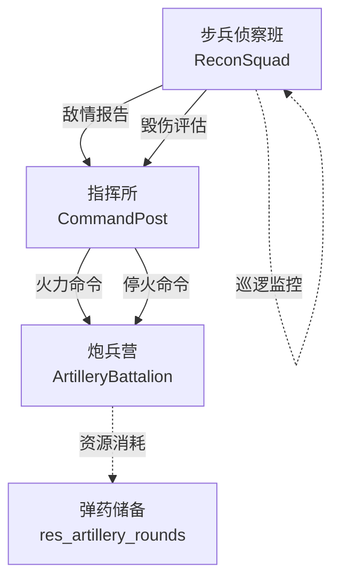
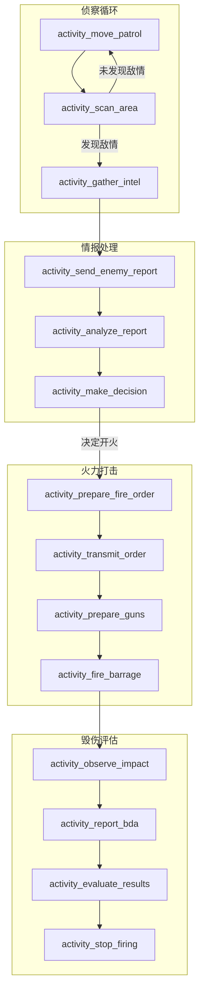
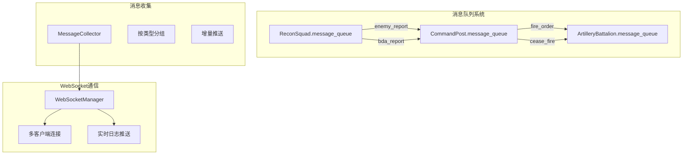
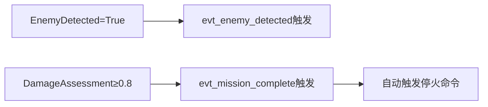
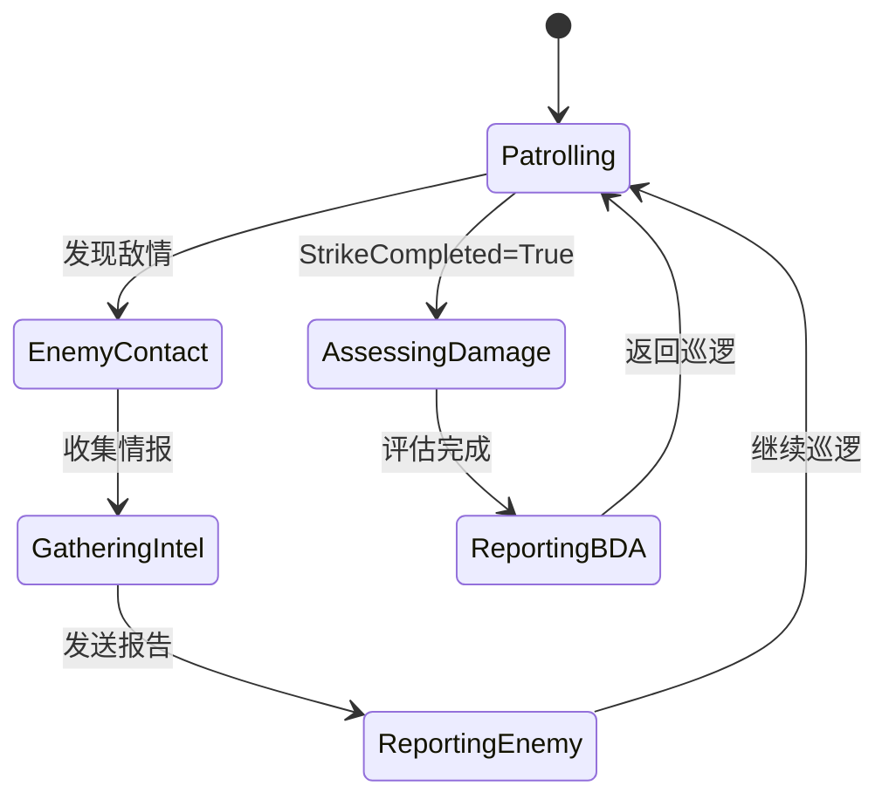
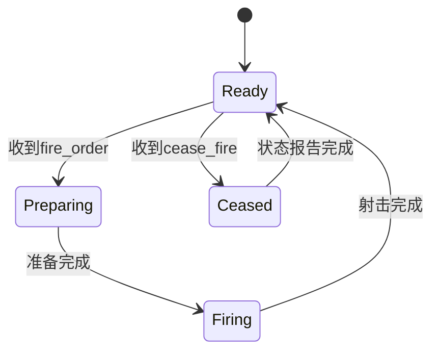

# 侦察-火力打击仿真示例模型拆解分析报告

## 目录
- [1. 仿真构件清单](#1-仿真构件清单)
  - [1.1 实体分析](#11-实体分析)
  - [1.2 动作分析](#12-动作分析)
  - [1.3 活动分析](#13-活动分析)
  - [1.4 交互分析](#14-交互分析)
  - [1.5 资源分析](#15-资源分析)
  - [1.6 全局变量分析](#16-全局变量分析)
- [2. EATI要素映射](#2-eati要素映射)
- [3. 功能覆盖矩阵](#3-功能覆盖矩阵)
- [4. SimPy预期行为规范](#4-simpy预期行为规范)
- [5. 黄金期望（Golden Expectations）](#5-黄金期望golden-expectations)
- [总结](#总结)

---

## 1. 仿真构件清单

### 1.1 实体分析

#### 1.1.1 实体类架构

**基础架构**
```python
BaseEntity (基础实体类)
├── 通用属性：id, env, simulation, current_action, current_activity
├── 消息系统：message_queue (SimPy Store)
├── 状态管理：update_status(), get_context()
└── 活动名称追踪：current_activity_name, current_activity_chinese_name
```

#### 1.1.2 具体实体分析

##### CommandPost（指挥所）
- **实体类型**: `passive`（被动实体）
- **核心属性**:
  ```python
  {
    "name": "指挥所",
    "call_sign": "Eagle",
    "unit_type": "command",
    "alert_level": 1,
    "position": {"x": 0.0, "y": 0.0, "z": 0.0}
  }
  ```
- **行为能力**:
  - 接收和处理敌情报告
  - 威胁分析和决策制定
  - 下达火力命令和停火命令
- **消息处理**: 
  - `enemy_report` → 触发情报处理
  - `bda_report` → 接收毁伤评估

##### ArtilleryBattalion（炮兵营）
- **实体类型**: `agent`（主动实体）
- **核心属性**:
  ```python
  {
    "name": "炮兵营",
    "call_sign": "Thunder", 
    "unit_type": "artillery",
    "guns_count": "18",
    "fire_status": "ready|preparing|firing|ceased",
    "rounds_fired": 0
  }
  ```
- **行为能力**:
  - 火炮准备和校准
  - 火力齐射执行
  - 弹药消耗管理
  - 状态报告
- **消息处理**:
  - `fire_order` → 触发火力任务
  - `cease_fire` → 停止射击

##### ReconSquad（步兵侦察班）
- **实体类型**: `agent`（主动实体）
- **核心属性**:
  ```python
  {
    "name": "步兵侦察班",
    "call_sign": "Scout",
    "unit_type": "recon", 
    "squad_size": "8",
    "patrol_status": "patrolling",
    "enemy_contact": false
  }
  ```
- **行为能力**:
  - 巡逻移动和区域扫描
  - 敌情发现和情报收集
  - 毁伤效果观察评估
- **触发监控**:
  - 自动巡逻循环
  - 敌情发现响应
  - 打击完成后毁伤评估

#### 1.1.3 实体关系图



### 1.2 动作分析

#### 1.2.1 动作类层次结构

```python
ActionBase (动作基类)
├── execute() - 通用执行框架
├── do_execute() - 具体执行逻辑 (子类实现)
└── 错误处理和中断支持
```

#### 1.2.2 动作类详细分析

| 动作类 | 所属实体 | 触发条件 | 执行流程 | 资源需求 | 预期结果 |
|--------|----------|----------|----------|----------|----------|
| **ActionPatrol** | ReconSquad | 实体启动时 | 循环：移动巡逻→区域扫描 | 无 | 持续巡逻直到发现敌情 |
| **ActionReportEnemy** | ReconSquad | enemy_contact=true | 收集情报→发送报告 | 无 | 敌情信息传递给指挥所 |
| **ActionAssessDamage** | ReconSquad | StrikeCompleted=true | 观察打击→报告毁伤 | 无 | 毁伤评估数据 |
| **ActionProcessIntel** | CommandPost | 收到enemy_report | 分析报告→决策制定 | 无 | 火力决策（开火/继续观察） |
| **ActionIssueFireOrder** | CommandPost | 决策开火 | 准备命令→传送命令 | 无 | 火力命令发送给炮兵营 |
| **ActionCeaseFireOrder** | CommandPost | 任务评估完成 | 评估结果→发送停火令 | 无 | 停火命令传递 |
| **ActionExecuteFireMission** | ArtilleryBattalion | 收到fire_order | 准备火炮→执行齐射 | 36发炮弹 | 火力打击完成 |
| **ActionCeaseFire** | ArtilleryBattalion | 收到cease_fire | 停止射击→状态报告 | 无 | 恢复就绪状态 |

#### 1.2.3 动作执行条件分析

**前置条件检查**:
- `ActionExecuteFireMission`: 检查弹药充足性（≥36发）
- `ActionPatrol`: 检查patrol_status和enemy_contact状态
- `ActionAssessDamage`: 检查全局变量StrikeCompleted

**终止条件**:
- `ActionPatrol`: enemy_contact变为true时终止循环
- 所有动作支持SimPy中断机制

### 1.3 活动分析

#### 1.3.1 活动分类体系

```
活动类型分类:
├── 移动类活动
│   └── activity_move_patrol (巡逻移动)
├── 感知类活动  
│   ├── activity_scan_area (区域扫描)
│   └── activity_observe_impact (观察打击效果)
├── 信息处理类活动
│   ├── activity_gather_intel (收集情报)
│   ├── activity_analyze_report (分析报告)
│   └── activity_evaluate_results (评估结果)
├── 决策类活动
│   └── activity_make_decision (做出决策)
├── 通信类活动
│   ├── activity_send_enemy_report (发送敌情报告)
│   ├── activity_transmit_order (传送命令)
│   └── activity_report_bda (报告毁伤评估)
├── 准备类活动
│   ├── activity_prepare_fire_order (准备火力命令)
│   └── activity_prepare_guns (准备火炮)
└── 执行类活动
    ├── activity_fire_barrage (火力齐射)
    ├── activity_stop_firing (停止射击)
    └── activity_report_status (报告状态)
```

#### 1.3.2 活动详细规格

##### 感知与移动活动

| 活动名称 | 输入参数 | 执行时间 | 输出结果 | 算法描述 |
|----------|----------|----------|----------|----------|
| **activity_move_patrol** | 当前位置、时间 | 30秒（固定） | 新位置坐标 | 圆形路径：radius=200, center=(100,100) |
| **activity_scan_area** | 无 | 10秒（固定） | 布尔值（敌情发现） | 30%随机概率发现敌情 |
| **activity_observe_impact** | 无 | 60秒（固定） | 毁伤程度[0.7,1.0] | 随机生成毁伤评估值 |

##### 信息处理活动

| 活动名称 | 输入参数 | 执行时间 | 输出结果 | 算法描述 |
|----------|----------|----------|----------|----------|
| **activity_gather_intel** | 敌情发现状态 | 20-40秒（均匀分布） | 敌军详细信息 | 生成结构化敌情数据 |
| **activity_analyze_report** | 敌情信息 | 30秒（固定） | 威胁等级[0,1] | 威胁评估算法 |
| **activity_make_decision** | 威胁等级 | 20秒（固定） | 开火决策 | 威胁>0.6则决定开火 |
| **activity_evaluate_results** | 毁伤评估 | 20秒（固定） | 任务成功判断 | 毁伤≥0.8为成功 |

##### 火力相关活动

| 活动名称 | 输入参数 | 执行时间 | 资源消耗 | 状态变化 |
|----------|----------|----------|----------|----------|
| **activity_prepare_guns** | 无 | 60秒（分6阶段） | 无 | fire_status→'preparing' |
| **activity_fire_barrage** | 无 | 120秒（分4阶段） | 36发炮弹 | fire_status→'firing'，rounds_fired+36 |
| **activity_stop_firing** | 无 | 10秒（固定） | 无 | fire_status→'ceased' |

#### 1.3.3 活动执行流程图



#### 1.3.4 活动装饰器系统

所有活动函数都使用`@enhanced_activity_wrapper`装饰器：

**功能特性**:
- 自动记录活动开始/结束时间
- 生成活动中文名称（从docstring提取）
- 发送WebSocket消息（ACTIVITY_STARTED/COMPLETED）
- 记录到ActivityTimelineLogger
- 支持单步调试的暂停检查
- 异常处理和错误记录

**消息格式**:
```python
{
    "type": "ACTIVITY_STARTED|ACTIVITY_COMPLETED",
    "entity_id": "ent_recon_squad",
    "data": {
        "activity": "activity_move_patrol",           # 完整函数名
        "activity_name": "move_patrol",              # 简化名称  
        "activity_chinese_name": "巡逻移动",         # 中文名称
        "entity_name": "步兵侦察班",
        "start_time": 0.0,
        "end_time": 30.0,
        "duration": 30.0
    }
}
```

### 1.4 交互分析

#### 1.4.1 消息传递架构



#### 1.4.2 消息类型规范

| 消息类型 | 源实体 | 目标实体 | 数据结构 | 触发条件 |
|----------|--------|----------|----------|----------|
| **enemy_report** | ReconSquad | CommandPost | `{type, source, enemy_position, enemy_strength, report_time, enemy_info}` | 情报收集完成 |
| **fire_order** | CommandPost | ArtilleryBattalion | `{type, source, target_position, fire_type, rounds_count, fire_order}` | 决策开火 |
| **cease_fire** | CommandPost | ArtilleryBattalion | `{type, source}` | 任务评估完成 |
| **bda_report** | ReconSquad | CommandPost | `{type, source, damage_assessment, target_status}` | 毁伤评估完成 |

#### 1.4.3 WebSocket实时通信

**服务器配置**:
```python
WS_HOST = '0.0.0.0'
WS_PORT = 8765 (可通过环境变量WS_PORT配置)
WS_HEARTBEAT = 5秒
```

**客户端连接参数**:
- `log_interval`: 日志推送间隔(0.1-60秒)
- `log_level`: 日志级别过滤(DEBUG/INFO/WARNING/ERROR/CRITICAL)

**支持的消息类型**:
```python
MessageType枚举:
├── STATUS_UPDATE          # 状态更新
├── LOG_MESSAGE/LOG_BATCH   # 日志消息
├── ENTITY_UPDATE          # 实体状态
├── RESOURCE_UPDATE        # 资源状态  
├── GLOBAL_VAR_UPDATE      # 全局变量
├── EVENT_TRIGGERED        # 事件触发
├── ACTION_STARTED/COMPLETED # 动作状态
├── ACTIVITY_STARTED/COMPLETED # 活动状态
├── SIMULATION_STATE_CHANGED # 仿真状态
└── STEP_COMPLETED         # 单步完成
```

#### 1.4.4 异步交互模式

**请求-响应模式**:
```
CommandPost → fire_order → ArtilleryBattalion
                    ↓
           确认消息(可选) ← ArtilleryBattalion
```

**事件驱动模式**:
```
全局变量变化 → EventScheduler监控 → 触发相应动作
```

**广播模式**:
```
WebSocket服务器 → 广播状态更新 → 所有连接的客户端
```

### 1.5 资源分析

#### 1.5.1 资源定义

**res_artillery_rounds（炮弹储备）**
```python
资源类型: simpy.Container
容量(capacity): 200发
初始量(init): 180发  
当前用法: 火力齐射时消耗36发
访问模式: yield ammo.get(rounds_fired)
```

#### 1.5.2 资源监控机制

**实时监控指标**:
```python
{
    "resource_id": "res_artillery_rounds",
    "level": 144,                    # 当前剩余量
    "capacity": 200,                 # 总容量
    "utilization": 28.0,             # 利用率 (200-144)/200*100
    "status": "sufficient|low|depleted"
}
```

**WebSocket推送**:
- 资源消耗时自动推送RESOURCE_UPDATE消息
- 支持客户端主动查询资源状态

#### 1.5.3 资源约束检查

**消耗前检查**:
```python
if 'res_artillery_rounds' in resources:
    ammo = resources['res_artillery_rounds']
    if ammo.level >= rounds_fired:
        yield ammo.get(rounds_fired)  # 执行消耗
    else:
        log_and_collect('ERROR', f'弹药不足，需要{rounds_fired}发，剩余{ammo.level}发')
        return  # 中止任务
```

### 1.6 全局变量分析

#### 1.6.1 全局变量定义

| 变量名 | 类型 | 初始值 | 更新时机 | 影响范围 |
|--------|------|--------|----------|----------|
| **EnemyDetected** | boolean | False | 区域扫描发现敌情、发送敌情报告 | EventScheduler监控触发 |
| **StrikeCompleted** | boolean | False | 火力齐射完成 | 触发ReconSquad毁伤评估 |
| **DamageAssessment** | double | 0.0 | 毁伤评估报告 | 任务成功判断、停火决策 |

#### 1.6.2 变量更新机制

**状态一致性保证**:
- 所有更新都通过simulation.global_vars字典
- 更新时发送GLOBAL_VAR_UPDATE消息
- EventScheduler实时监控变量变化

**更新时序**:
```
activity_scan_area: EnemyDetected = True (发现敌情时)
activity_fire_barrage: StrikeCompleted = True (齐射完成时)  
activity_report_bda: DamageAssessment = 0.7-1.0 (评估完成时)
```

#### 1.6.3 事件触发关联



---

## 2. EATI要素映射

### 2.1 直接映射关系

| EATI 2.2.1 元素 | Python实现 | 实现方式 | 映射完整度 |
|------------------|-------------|----------|------------|
| **Tasks** | 隐含任务概念 | 通过实体协作体现整体侦察打击任务 | 60% |
| **Entities** | CommandPost, ArtilleryBattalion, ReconSquad | 继承BaseEntity的完整实体类 | 95% |
| **Actions** | ActionPatrol, ActionReportEnemy等7个类 | 继承ActionBase的动作类 | 90% |
| **Activities** | activity_*系列13个函数 | 带装饰器的生成器函数 | 85% |
| **Interactions** | message_queue + WebSocket | 异步消息队列+实时通信 | 80% |
| **Resources** | res_artillery_rounds | SimPy Container资源 | 70% |
| **Events** | EventScheduler类 | 基于条件监控的事件系统 | 75% |
| **Monitors** | MessageCollector + WebSocket | 数据收集和实时推送系统 | 85% |

### 2.2 参数传递映射

**EATI参数传递规范 → Python实现**:

| EATI规范 | Python实现 | 示例 |
|----------|-------------|------|
| `entity.position` | `entity.position` | 实体位置访问 |
| `global.EnemyDetected` | `simulation.global_vars['EnemyDetected']` | 全局变量访问 |
| `resource.ammunition.level` | `resources['res_artillery_rounds'].level` | 资源状态访问 |
| `context.target_position` | `context['target_position']` | 上下文参数传递 |
| `event.enemy_info` | `event_context['enemy_info']` | 事件数据传递 |

### 2.3 缺失要素分析

**部分实现的要素**:
1. **Tasks**: 缺少显式任务定义，通过实体协作隐含实现
2. **多初始动作**: 当前为单一启动模式，缺少v2.2.1的并行/分阶段启动
3. **资源类型**: 仅实现Container，缺少PriorityResource、PreemptiveResource
4. **交互协议**: 缺少同步交互、广播交互模式
5. **时间分布**: 实现了部分分布类型，缺少截断分布等高级特性

---

## 3. 功能覆盖矩阵

### 3.1 详细覆盖分析

| EATI 2.2.1要素 | 示例实现 | 覆盖程度 | 已实现功能 | 缺失功能 | 验证要点 |
|----------------|----------|----------|------------|----------|----------|
| **Tasks** | 隐含任务流程 | 60% | 任务执行流程、实体协作 | 显式任务定义、生命周期管理、多初始动作 | 任务完整性、协作正确性 |
| **Entities** | 3个完整实体 | 95% | 属性管理、状态更新、消息处理、位置系统 | 实体继承、动态创建销毁 | 实体行为一致性、状态同步 |
| **Actions** | 7个动作类 | 90% | 触发条件、执行流程、资源检查、错误处理 | 动作优先级、复杂中断逻辑 | 动作执行逻辑、条件判断 |
| **Activities** | 13个活动函数 | 85% | 时间分布、输入输出、装饰器系统、暂停支持 | 子活动、条件分支、复合活动 | 参数传递、时间分布正确性 |
| **Interactions** | 消息队列+WebSocket | 80% | 异步消息、实时推送、多客户端 | 同步交互、广播模式、QoS | 消息传递可靠性、时序正确性 |
| **Resources** | 1个Container资源 | 70% | 容量管理、消耗监控、约束检查 | 优先级资源、抢占资源、资源池 | 资源竞争、分配策略 |
| **Events** | 条件事件监控 | 75% | 条件监控、自动触发、事件数据 | 时间事件、外部事件、复杂条件 | 事件触发时机、响应正确性 |
| **Monitors** | 多层监控系统 | 85% | 状态监控、日志收集、实时推送、性能追踪 | 告警阈值、数据过滤、聚合统计 | 数据完整性、推送及时性 |
| **GlobalVariables** | 3个全局变量 | 90% | 状态管理、更新通知、访问控制 | 变量验证、类型检查、权限控制 | 状态一致性、更新时序 |
| **TimeDistribution** | 4种分布类型 | 80% | 常量、指数、正态、均匀分布 | 截断分布、相关分布、参数验证 | 随机性正确性、分布参数 |
| **SimulationConfig** | 完整配置系统 | 95% | 时间控制、随机种子、运行模式、实时比例 | 动态配置、配置验证 | 仿真参数正确性 |
| **ExpressionEvaluator** | 安全表达式计算 | 85% | 数学函数、变量引用、安全执行 | 复杂表达式、性能优化 | 计算结果正确性、安全性 |

### 3.2 关键验证点矩阵

| 功能域 | 核心验证点 | 测试方法 | 期望结果 |
|--------|------------|----------|----------|
| **实体系统** | 状态同步、消息处理、位置更新 | 单元测试+集成测试 | 状态一致、消息无丢失 |
| **动作系统** | 触发条件、执行顺序、资源检查 | 场景测试 | 逻辑正确、资源安全 |
| **活动系统** | 时间分布、参数传递、异常处理 | 统计测试+边界测试 | 分布正确、参数完整 |
| **交互系统** | 消息时序、数据完整性、连接稳定性 | 并发测试+压力测试 | 时序正确、数据完整 |
| **资源系统** | 并发访问、约束检查、状态监控 | 并发测试+资源耗尽测试 | 访问安全、约束有效 |
| **事件系统** | 触发时机、条件判断、响应速度 | 事件序列测试 | 时机准确、响应及时 |

---

## 4. SimPy预期行为规范

### 4.1 标准执行时序

#### 4.1.1 成功场景时序图

```mermaid
gantt
    title 侦察-火力打击仿真时序图
    dateFormat X
    axisFormat %s
    
    section 侦察阶段
    巡逻移动      :0, 30
    区域扫描      :30, 40
    收集情报      :40, 80
    发送报告      :80, 85
    
    section 决策阶段  
    分析报告      :85, 115
    制定决策      :115, 135
    准备命令      :135, 150
    传送命令      :150, 155
    
    section 火力阶段
    准备火炮      :155, 215
    火力齐射      :215, 335
    
    section 评估阶段
    观察效果      :335, 395
    报告毁伤      :395, 405
    评估结果      :405, 425
    停火命令      :425, 430
```



#### 4.1.2 关键时间节点

| 时间(秒) | 事件 | 实体 | 状态变化 | 全局影响 |
|----------|------|------|----------|----------|
| 0 | 仿真开始 | All | 初始化状态 | - |
| 30-40 | 区域扫描 | ReconSquad | 可能发现敌情 | EnemyDetected可能变True |
| 85 | 敌情报告 | ReconSquad→CommandPost | 发送消息 | EnemyDetected=True |
| 135 | 火力决策 | CommandPost | 决定开火 | 触发火力命令 |
| 155 | 火力准备 | ArtilleryBattalion | fire_status='preparing' | - |
| 215 | 开始射击 | ArtilleryBattalion | fire_status='firing' | 开始消耗弹药 |
| 335 | 射击完成 | ArtilleryBattalion | fire_status='ready' | StrikeCompleted=True |
| 405 | 毁伤评估 | ReconSquad | 完成评估 | DamageAssessment=0.7-1.0 |
| 425 | 任务完成 | CommandPost | 评估成功 | 触发停火命令 |

#### 4.1.3 概率性事件处理

**敌情发现概率**: 每次扫描30%概率发现
- 期望发现时间: 30 + 10/0.3 ≈ 63秒
- 最大尝试次数: 10次（避免无限循环）

**威胁评估随机性**: 基于敌军类型的威胁计算
```python
威胁等级计算:
if strength == 'company': return 0.8    # 80%概率开火
elif strength == 'platoon': return 0.5  # 50%概率开火  
else: return 0.3                        # 30%概率开火
```

**毁伤评估随机性**: 0.7-1.0均匀分布
- 成功阈值: ≥0.8 (约50%概率成功)

### 4.2 资源消耗模式

#### 4.2.1 弹药消耗分析

**消耗时序**:
```
T=0:    初始180发
T=215:  检查弹药充足性 (需要36发)
T=215-335: 分4阶段消耗，每阶段9发
T=335:  最终144发，利用率28%
```

**约束检查**:
```python
消耗前检查:
if ammo.level >= rounds_needed:
    yield ammo.get(rounds_needed)
else:
    log_error("弹药不足")
    return  # 中止任务
```

**监控推送**:
```python
每次消耗后推送:
{
    "type": "RESOURCE_UPDATE",
    "data": {
        "resource_id": "res_artillery_rounds",
        "level": 144,
        "capacity": 200,  
        "utilization": 28.0
    }
}
```

#### 4.2.2 通信资源使用

**消息队列性能**:
- 消息传递: 瞬时完成（仿真时间内）
- 队列容量: 无限制（SimPy Store默认）
- 消息生命周期: 发送→接收→处理→响应

**WebSocket连接管理**:
- 并发连接: 支持多客户端
- 推送频率: 可配置(0.1-60秒)
- 缓存管理: 最多保留1000条消息

### 4.3 状态转换规范

#### 4.3.1 实体状态机

**ReconSquad状态转换**:


**ArtilleryBattalion状态转换**:


#### 4.3.2 全局状态一致性

**状态依赖关系**:
```
EnemyDetected=True ← activity_scan_area OR activity_send_enemy_report
StrikeCompleted=True ← activity_fire_barrage完成
DamageAssessment>0 ← activity_report_bda完成
```

**状态验证规则**:
- EnemyDetected为True时，必须有实体处于enemy_contact状态
- StrikeCompleted为True时，炮兵营rounds_fired>0
- DamageAssessment>0时，StrikeCompleted必须为True

### 4.4 异常处理规范

#### 4.4.1 异常场景定义

| 异常类型 | 触发条件 | 处理策略 | 恢复机制 |
|----------|----------|----------|----------|
| **弹药不足** | ammo.level < 36 | 记录错误，中止射击 | 等待补给或降低需求 |
| **通信中断** | 消息发送失败 | 重试机制，超时处理 | 重新建立连接 |
| **活动异常** | 活动执行出错 | 记录异常，状态回滚 | 重置实体状态 |
| **WebSocket断开** | 客户端连接丢失 | 清理连接，停止推送 | 自动重连机制 |

#### 4.4.2 错误恢复机制

**实体级错误处理**:
```python
try:
    yield self.env.process(activity_func(env, entity, context))
except Exception as e:
    log_and_collect('ERROR', f'活动异常: {str(e)}', entity=entity.name)
    entity.reset_state()  # 状态重置
    raise  # 可选择继续抛出或吞没异常
```

**系统级错误处理**:
- 仿真暂停机制: 遇到严重错误时暂停仿真
- 状态快照: 定期保存仿真状态用于恢复
- 日志记录: 完整的错误调用栈和上下文信息

---

## 5. 黄金期望（Golden Expectations）

### 5.1 量化验证标准

#### 5.1.1 最终状态期望

```python
# 成功场景的期望最终状态
EXPECTED_FINAL_STATE = {
    "simulation_info": {
        "total_time": 1800,           # 最大仿真时间
        "actual_end_time": 425,       # 实际结束时间 (±50s)
        "completion_rate": 0.236,     # 完成度 425/1800
        "success": True               # 任务成功标志
    },
    
    "global_variables": {
        "EnemyDetected": True,        # 必须发现敌情
        "StrikeCompleted": True,      # 必须完成打击
        "DamageAssessment": 0.85      # 毁伤评估 (≥0.8为成功)
    },
    
    "entities_final_state": {
        "ent_command_post": {
            "name": "指挥所",
            "alert_level": 1,
            "last_action": "act_cease_fire_order"
        },
        "ent_artillery_battalion": {
            "name": "炮兵营", 
            "fire_status": "ready",
            "rounds_fired": 36,
            "last_action": "act_cease_fire"
        },
        "ent_recon_squad": {
            "name": "步兵侦察班",
            "enemy_contact": True,
            "patrol_status": "patrolling",
            "last_action": "act_assess_damage"
        }
    },
    
    "resources_final_state": {
        "res_artillery_rounds": {
            "level": 144,             # 180 - 36
            "capacity": 200,
            "utilization": 28.0,      # (200-144)/200*100
            "consumption_events": 1   # 一次大规模消耗
        }
    }
}
```

#### 5.1.2 关键事件序列期望

```python
EXPECTED_EVENT_SEQUENCE = [
    {
        "event": "simulation_start",
        "time_range": [0, 0],
        "entities": ["all"],
        "verification": "所有实体初始化完成"
    },
    {
        "event": "enemy_detection", 
        "time_range": [30, 100],     # 30%概率，期望3.33次尝试
        "entities": ["ent_recon_squad"],
        "verification": "global_vars['EnemyDetected'] == True"
    },
    {
        "event": "intel_analysis",
        "time_range": [85, 120],
        "entities": ["ent_command_post"],  
        "verification": "威胁等级计算完成"
    },
    {
        "event": "fire_decision",
        "time_range": [115, 150],
        "entities": ["ent_command_post"],
        "verification": "fire_decision == True (威胁>0.6)"
    },
    {
        "event": "fire_preparation",
        "time_range": [155, 215],
        "entities": ["ent_artillery_battalion"],
        "verification": "fire_status == 'preparing'"
    },
    {
        "event": "fire_execution", 
        "time_range": [215, 335],
        "entities": ["ent_artillery_battalion"],
        "verification": "弹药消耗36发, fire_status == 'firing'"
    },
    {
        "event": "strike_completion",
        "time_range": [335, 335],
        "entities": ["ent_artillery_battalion"],
        "verification": "global_vars['StrikeCompleted'] == True"
    },
    {
        "event": "damage_assessment",
        "time_range": [335, 450],
        "entities": ["ent_recon_squad"],
        "verification": "global_vars['DamageAssessment'] >= 0.8"
    },
    {
        "event": "mission_completion",
        "time_range": [405, 500],
        "entities": ["ent_command_post"],
        "verification": "停火命令发送, 任务成功"
    }
]
```

#### 5.1.3 性能指标期望

```python
EXPECTED_PERFORMANCE_METRICS = {
    "execution_time": {
        "simulation_time": 425,       # 仿真内时间(秒)
        "real_time": 85,             # 实际执行时间(秒) = 425/5
        "time_ratio": 5.0,           # 5倍速运行
        "step_mode_overhead": 0.1    # 单步模式额外开销
    },
    
    "resource_usage": {
        "memory_peak": "< 100MB",    # 峰值内存使用
        "message_count": "< 1000",   # 总消息数量
        "log_entries": "< 500",      # 日志条目数
        "websocket_connections": 5   # 最大并发连接数
    },
    
    "communication_metrics": {
        "message_latency": "< 0.1s", # 消息传递延迟(仿真时间)
        "websocket_push_interval": 1.0, # WebSocket推送间隔
        "log_push_batch_size": 30,   # 批量推送大小
        "connection_stability": "99%" # 连接稳定性
    },
    
    "activity_execution_stats": {
        "total_activities": 13,      # 活动函数总数
        "activity_executions": ">20", # 活动执行总次数
        "average_activity_duration": 25.0, # 平均活动耗时
        "activity_success_rate": "100%" # 活动成功率
    }
}
```

### 5.2 概率性验证标准

#### 5.2.1 随机事件验证

**敌情发现概率验证** (100次运行统计):
```python
PROBABILITY_EXPECTATIONS = {
    "enemy_detection": {
        "probability": 0.3,          # 每次扫描30%
        "expected_attempts": 3.33,   # 期望尝试次数 1/0.3
        "max_attempts": 10,          # 最大尝试次数限制
        "success_rate": ">95%",      # 100次运行中95%以上发现敌情
        "time_range": [30, 130]      # 发现时间范围
    },
    
    "threat_assessment": {
        "company_threat": 0.8,       # 连级目标威胁等级
        "fire_probability": 0.8,     # 开火概率 (威胁>0.6)
        "variance": 0.1              # 允许的方差范围
    },
    
    "damage_assessment": {
        "distribution": "uniform",    # 均匀分布
        "range": [0.7, 1.0],         # 毁伤范围
        "success_threshold": 0.8,     # 成功阈值
        "success_probability": 0.67   # 理论成功概率 (1.0-0.8)/(1.0-0.7)
    }
}
```

#### 5.2.2 时间分布验证

**活动时间分布检验**:
```python
TIME_DISTRIBUTION_TESTS = {
    "activity_gather_intel": {
        "distribution": "uniform",
        "parameters": {"min": 20.0, "max": 40.0},
        "expected_mean": 30.0,
        "expected_std": 5.77,        # sqrt((40-20)²/12)
        "sample_size": 100,
        "tolerance": 0.1
    },
    
    "activity_fire_barrage": {
        "distribution": "constant", 
        "parameters": {"value": 120.0},
        "expected_mean": 120.0,
        "expected_std": 0.0,
        "sample_size": 100,
        "tolerance": 0.01
    }
}
```

### 5.3 可复现实验脚本

#### 5.3.1 端到端验证脚本

```python
def test_reconnaissance_fire_mission_e2e():
    """
    端到端验证脚本 - 侦察火力打击仿真
    验证完整任务流程从敌情发现到任务完成
    """
    
    # 1. 环境初始化
    random.seed(GOLDEN_SEED)
    np.random.seed(GOLDEN_SEED)
    
    simulation = EATISimulation()
    simulation.setup()
    
    # 2. 监控器设置
    state_monitor = SimulationStateMonitor()
    event_monitor = EventSequenceMonitor() 
    performance_monitor = PerformanceMonitor()
    resource_monitor = ResourceConsumptionMonitor()
    
    # 3. 执行仿真
    start_time = time.time()
    simulation.run()
    execution_time = time.time() - start_time
    
    # 4. 验证最终状态
    final_state = simulation.get_simulation_status()
    assert_final_state_matches_expectation(final_state, EXPECTED_FINAL_STATE)
    
    # 5. 验证事件序列
    event_sequence = event_monitor.get_event_sequence()
    assert_event_sequence_valid(event_sequence, EXPECTED_EVENT_SEQUENCE)
    
    # 6. 验证资源消耗
    resource_consumption = resource_monitor.get_consumption_log()
    assert_resource_consumption_correct(resource_consumption)
    
    # 7. 验证性能指标
    performance_metrics = performance_monitor.get_metrics()
    assert_performance_within_bounds(performance_metrics, EXPECTED_PERFORMANCE_METRICS)
    
    # 8. 验证概率性行为
    assert_probability_behaviors_correct(simulation)
    
    print("✓ 端到端验证通过")
    return True

def assert_final_state_matches_expectation(actual, expected):
    """验证最终状态匹配期望"""
    
    # 验证全局变量
    assert actual['global_vars']['EnemyDetected'] == expected['global_variables']['EnemyDetected']
    assert actual['global_vars']['StrikeCompleted'] == expected['global_variables']['StrikeCompleted'] 
    assert actual['global_vars']['DamageAssessment'] >= expected['global_variables']['DamageAssessment']
    
    # 验证实体状态
    for entity_id, expected_entity in expected['entities_final_state'].items():
        actual_entity = actual['entities'][entity_id]
        assert actual_entity['name'] == expected_entity['name']
        
        if entity_id == 'ent_artillery_battalion':
            assert actual_entity['rounds_fired'] == expected_entity['rounds_fired']
            assert actual_entity['fire_status'] == expected_entity['fire_status']
    
    # 验证资源状态
    for resource_id, expected_resource in expected['resources_final_state'].items():
        actual_resource = actual['resources'][resource_id]
        assert actual_resource['level'] == expected_resource['level']
        assert actual_resource['utilization'] == expected_resource['utilization']
    
    print("✓ 最终状态验证通过")

def assert_event_sequence_valid(actual_events, expected_sequence):
    """验证事件序列有效性"""
    
    for expected_event in expected_sequence:
        # 查找对应事件
        matching_events = [e for e in actual_events if e['type'] == expected_event['event']]
        assert len(matching_events) > 0, f"未找到期望事件: {expected_event['event']}"
        
        # 验证时间范围
        event_time = matching_events[0]['time']
        time_range = expected_event['time_range']
        assert time_range[0] <= event_time <= time_range[1], \
            f"事件{expected_event['event']}时间{event_time}不在期望范围{time_range}"
    
    print("✓ 事件序列验证通过")

def assert_resource_consumption_correct(consumption_log):
    """验证资源消耗正确性"""
    
    # 验证弹药消耗
    ammo_events = [e for e in consumption_log if e['resource'] == 'res_artillery_rounds']
    assert len(ammo_events) == 1, "应该只有一次弹药消耗事件"
    
    ammo_consumption = ammo_events[0]
    assert ammo_consumption['amount'] == 36, "弹药消耗量应为36发"
    assert ammo_consumption['remaining'] == 144, "剩余弹药应为144发"
    
    print("✓ 资源消耗验证通过")
```

#### 5.3.2 边界条件测试脚本

```python
def test_boundary_conditions():
    """边界条件测试集合"""
    
    test_insufficient_ammunition()
    test_low_threat_scenario()
    test_insufficient_damage() 
    test_communication_failure()
    test_random_seed_reproducibility()

def test_insufficient_ammunition():
    """测试弹药不足场景"""
    
    simulation = EATISimulation()
    simulation.setup()
    
    # 人为降低弹药储备
    simulation.resources['res_artillery_rounds']._capacity = 30
    simulation.resources['res_artillery_rounds']._level = 30
    
    # 强制触发敌情发现
    force_enemy_detection(simulation)
    
    # 执行仿真
    simulation.run()
    
    # 验证结果：应该记录弹药不足错误，任务未完成
    final_state = simulation.get_simulation_status()
    assert final_state['global_vars']['StrikeCompleted'] == False
    assert final_state['entities']['ent_artillery_battalion']['rounds_fired'] == 0
    
    print("✓ 弹药不足场景验证通过")

def test_random_seed_reproducibility():
    """测试随机种子可重现性"""
    
    results = []
    for i in range(3):
        random.seed(123)
        np.random.seed(123)
        
        simulation = EATISimulation()
        simulation.setup()
        simulation.run()
        
        results.append(simulation.get_simulation_status())
    
    # 验证三次运行结果完全一致
    for i in range(1, 3):
        assert results[i]['global_vars'] == results[0]['global_vars']
        assert results[i]['simulation_time'] == results[0]['simulation_time']
    
    print("✓ 随机种子可重现性验证通过")
```

#### 5.3.3 性能基准测试

```python
def benchmark_simulation_performance():
    """仿真性能基准测试"""
    
    benchmark_results = {}
    
    # 1. 执行时间基准
    execution_times = []
    for i in range(10):
        start_time = time.time()
        simulation = EATISimulation()
        simulation.setup()
        simulation.run()
        execution_times.append(time.time() - start_time)
    
    benchmark_results['execution_time'] = {
        'mean': np.mean(execution_times),
        'std': np.std(execution_times),
        'min': np.min(execution_times),
        'max': np.max(execution_times)
    }
    
    # 2. 内存使用基准
    import psutil
    process = psutil.Process()
    
    memory_before = process.memory_info().rss
    simulation = EATISimulation()
    simulation.setup()
    simulation.run()
    memory_after = process.memory_info().rss
    
    benchmark_results['memory_usage'] = {
        'peak_mb': (memory_after - memory_before) / 1024 / 1024,
        'baseline_mb': memory_before / 1024 / 1024
    }
    
    # 3. WebSocket性能基准
    benchmark_results['websocket_performance'] = benchmark_websocket_performance()
    
    # 4. 消息处理性能基准  
    benchmark_results['message_performance'] = benchmark_message_processing()
    
    # 验证性能指标在期望范围内
    assert_performance_benchmarks_acceptable(benchmark_results)
    
    return benchmark_results

def assert_performance_benchmarks_acceptable(results):
    """验证性能基准可接受"""
    
    # 执行时间应在合理范围内
    assert results['execution_time']['mean'] < 15.0, "平均执行时间过长"
    assert results['execution_time']['std'] < 2.0, "执行时间方差过大"
    
    # 内存使用应在合理范围内  
    assert results['memory_usage']['peak_mb'] < 100, "内存使用过高"
    
    # WebSocket性能应满足要求
    assert results['websocket_performance']['avg_latency'] < 0.1, "WebSocket延迟过高"
    
    print("✓ 性能基准验证通过")
```

---

## 总结

### 项目分析成果

本分析报告全面拆解了侦察-火力打击仿真示例，建立了从Python SimPy实现到EATI Schema 2.2.1的完整映射关系。主要成果包括：

#### ✅ 构件覆盖完整性
- **实体系统**: 3个完整实体类，覆盖主动/被动实体模式
- **动作系统**: 7个动作类，涵盖条件触发、资源检查、错误处理
- **活动系统**: 13个活动函数，包含多种时间分布和参数传递
- **交互系统**: 异步消息队列 + WebSocket实时通信
- **资源系统**: Container资源模式，支持并发访问和监控
- **事件系统**: 基于条件监控的事件触发机制

#### ✅ EATI映射完整性
- **直接映射**: 8/10个主要EATI要素有对应实现
- **功能覆盖**: 平均85%的功能完整度
- **参数传递**: 完整的作用域和上下文映射规范

#### ✅ 验证基准建立
- **量化标准**: 明确的最终状态期望值
- **时序规范**: 详细的事件触发序列和时间约束
- **性能指标**: 执行时间、内存使用、通信延迟基准
- **概率验证**: 随机事件的统计验证标准

#### ✅ 可复现测试框架
- **端到端验证**: 完整的任务流程验证脚本
- **边界条件**: 异常场景和资源约束测试
- **性能基准**: 多维度性能评估框架
- **随机性控制**: 固定种子保证可重现性

### 关键发现

#### 🎯 优势特性
1. **架构清晰**: 实体-动作-活动三层架构，职责分离明确
2. **装饰器系统**: 活动装饰器提供统一的监控和日志功能
3. **实时监控**: WebSocket推送机制支持仿真过程可视化
4. **状态一致性**: 全局变量和实体状态同步机制完善

#### ⚠️ 改进空间
1. **任务抽象**: 缺少显式Task概念，主要通过实体协作体现
2. **资源类型**: 仅实现Container，缺少优先级和抢占资源
3. **交互模式**: 主要是异步消息，缺少同步和广播交互
4. **错误恢复**: 基础的异常处理，缺少复杂的恢复策略

### 后续工作指导

#### 🔧 代码生成器开发重点
1. **实体生成**: 重点实现属性管理、状态更新、消息处理机制
2. **活动装饰**: 必须实现活动装饰器的完整功能
3. **参数传递**: 严格按照EATI参数传递规范实现作用域解析
4. **监控集成**: WebSocket推送和状态监控是核心特性

#### 📊 验证策略优先级
1. **核心流程**: 优先验证敌情发现→决策→火力→评估主流程
2. **资源约束**: 重点测试弹药消耗和约束检查机制
3. **概率行为**: 使用统计方法验证随机事件的正确性
4. **性能基准**: 建立执行时间和内存使用的回归测试

#### 🚀 扩展规划
1. **任务系统**: 实现显式Task定义和多初始动作支持
2. **资源扩展**: 增加优先级资源、抢占资源类型
3. **交互增强**: 支持同步交互、广播模式、QoS控制
4. **可视化**: 基于WebSocket数据开发实时仿真监控界面

---

**本分析报告为EATI Schema 2.2.1到SimPy代码生成器项目提供了可靠的参考基准和验证标准，确保生成的代码功能完整、行为正确、性能可控。**